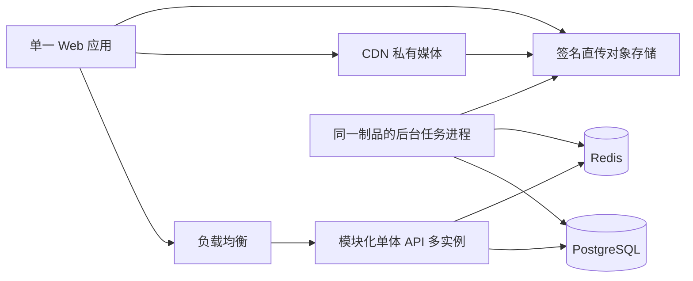

# 总体架构与目录边界

版本：v1.0 设计定稿｜更新：2026-09-23｜输入：业务规划包 v8.3，RUN_ID YXT20260921A。

本文是技术设计，不是已实现系统。方案 A 已由用户选定；下述工程细节为本轮选定设计，承载性仍须权限预研和容量测试。业务规则以用户明确决策为准，输入原文不修改。已确认决策见 [决策登记](00_技术方案索引与决策.md)。

## 1. 目标与范围

交付一个模块化单体，支持 5 万以内人员、通常不超过 1 万同时在学，打通组织人员、在线内容、自主学习、项目指派、面授、学分激励、大纲变更和三张最小报表。大规模考试、调查引擎、通用审核、游客、HR 同步及外部消息触达不在本期。

客户员工本期通过正式人员账号参与。T-07已确认同一企业站点内按客户公司隔离人员与学习数据，内部管理员按获授公司范围跨客户管理；课程与项目仍按授权共享。tenant_id为站点边界，company_id/data_company_id为公司边界，不新增SaaS开户、计费或独立客户部署。节点六范围、对象任命、公司范围必须共同满足，不能因同在一个项目而互看其他公司人员数据。

技术上的 schema、接口、索引和部署建议均为我方设计。尤其 D-42 重算规则是我方业务定义，不能声称与原站一致。

## 2. 技术栈

| 层 | 方案 | 目的与限制 |
|---|---|---|
| Web | Vue 3、TypeScript、Vite、Vue Router、Element Plus；Pinia 管本地会话/UI状态 | 一个前端应用、一次构建；管理端和学员端路由分区，模块分别懒加载；菜单不充当安全边界 |
| API | Node.js 受支持的 LTS、NestJS、Fastify、TypeScript | 一个后端代码库、一个业务应用；Nest 模块显式导入公共服务，禁止隐式全局业务依赖 |
| 数据访问 | PostgreSQL；建议 Drizzle ORM/查询构造器及审核后的 SQL 迁移 | 复杂范围、聚合和批量写允许参数化 SQL；ORM 不代替授权、事务和索引设计；权限预研验证适配性 |
| 缓存/协调 | Redis | 缓存、限流、任务唤醒和短租约；已确认的学习与账务以 PostgreSQL 为准 |
| 作业 | 同一后端制品的后台任务运行模式；建议 BullMQ 作唤醒/重试调度，PostgreSQL 保留任务事实与 outbox | 不拆独立业务微服务；队列遗失可按数据库待办重建，不能把 Redis 当奖励账本 |
| 媒体 | 兼容签名上传的对象存储、私有源站、CDN、后台媒体探测/转码 | 浏览器直传/直取；API 处理权限和元数据，避免承载视频字节流；供应商和预算待选 |
| 契约 | REST/JSON、OpenAPI、服务端 DTO 验证；内部公共服务与版本化事件 | 前端类型从契约产生，不导入后端实体或数据库类型 |
| 质量 | ESLint/依赖边界检查、单元测试、PostgreSQL 集成测试、Playwright、k6 | 工具选型建议；本轮未创建工程、未执行应用测试 |
| 部署 | Linux 容器、反向代理/负载均衡、托管 PostgreSQL/Redis 与对象存储优先 | 单人维护优先减少基础设施运维；开发 Compose、生产容器服务均不要求 Kubernetes |

实现启动时锁定 Node、包管理器、依赖确切版本和 lockfile，并验证 Nest/Fastify、ORM/驱动、队列适配兼容性。这里不伪称已核验某个未来最新版本；安全补丁升级与回归策略纳入运行手册。

## 3. 单体拓扑



API 和后台任务共享版本、模块边界、发布节奏、数据库与业务契约；后台运行模式是资源隔离方式，不是按业务拆分部署。CPU 密集转码放后台受限并发进程，不能堵塞 API 事件循环。单体允许多实例，不等于只允许一台机器或一个进程。

## 4. 目录草案与原站边界对应

下面是将来实现仓库的设计目录，**本轮没有创建这些工程目录**。建议实现仓库存放本地磁盘、用 Git 管理；本 iCloud 目录继续作为输入和文档交付位置，不自动搬移现有文件。

```text
learning-platform/
  apps/
    web/src/
      shell/                         # 登录、门户、统一布局、路由装配
      modules/
        organization/ knowledge/ training/ study/ offline/ report/ operations/
      platform/                      # authz客户端、站内消息、上传/下载入口
    server/src/
      bootstrap/                     # HTTP和后台运行入口、依赖装配
      workflows/                     # 跨模块用例编排，只调公开接口
      modules/
        organization/ knowledge/ training/ study/ offline/ report/ operations/
      platform/
        identity/ authz/ messaging/ files/ jobs/ audit/
      infrastructure/                # 数据源、事务、Redis、对象存储适配
  packages/
    contracts/                       # API DTO及公共事件契约，不放ORM实体
    ui/                              # 无业务规则的通用展示组件
    tooling/                         # lint、边界检查等开发配置
  migrations/<module>/
  tests/{contracts,integration,e2e,performance,architecture}/
  docs/{architecture,decisions,runbooks,acceptance}/
```

每个后端业务模块内部为 `public / application / domain / infrastructure / presentation`。`public`仅导出服务端口、DTO和事件定义；前端模块对外仅导出路由注册、页面入口或受控组件。跨模块依赖注入端口，bootstrap绑定实现，避免Organization和Authz互相导入Nest模块。授权专用组织事实端口是内部最小只读通路，不再递归调用权限服务；普通业务服务仍需统一鉴权。详细方向与检查见[09](09_技术决策与运行细化.md)。禁止创建汇集所有业务规则的shared/services。

| 原站边界（E004） | 本期模块 | 归属 |
|---|---|---|
| 我的企业 `/udp/` | organization | 部门、人员、岗位、标签与成员关系；角色授权配置调用中央 authz |
| 在线课堂 `/kng/` | knowledge | 分类、权限配置入口、课件、课程版本、媒体业务状态 |
| 培训中心/我的团队 `/o2o/` | training | 项目、大纲、参与关系、自动指派、完成/毕业；我的团队按直属经理关系 |
| 学员端 | study | 学习入口、会话、进度、完成事实、学习历史；具体内容仍属于来源模块 |
| 面授中心 `/flipstu/` | offline | 面授场次、考勤、请假、人工成绩、固定表单双向评价 |
| 报表中心 `/report/` | report | 三张报表、读模型、查询与导出；不反向修改学习事实 |
| 平台运营 `/jf/` | operations | 学分/时长规则、奖励策略、追溯流水、待抵扣、扣减结算 |
| 门户、通知、下载 | shell / messaging / files / jobs | 支撑能力保留边界；不扩建完整原站运营中心 |

authz 负责统一决策，不复制人员、课程或项目业务逻辑。所需对象属性由模块公开接口提供，或作为可验证的授权资源描述传入。

T-05/T-06补充：中央权限服务在各角色内处理人员覆盖，再合并同节点同动作的有效授权。项目负责人任命可派生管理后台壳及培训中心对应功能入口，项目数据和操作仅限任命对象；前端路由和后端接口共用这一能力结果。任命不赋予organization、knowledge、offline、report或operations的全局管理能力；其他独立角色的合法授权仍按T-05保留。取消任命只撤销其派生能力，后台是否仍可进入由剩余授权决定。

## 5. 依赖与事务规则

1. 跨模块只调用 `OrganizationPublic / KnowledgePublic / TrainingPublic / StudyPublic / OfflinePublic / OperationsPublic` 等公开服务，或消费公开事件；禁止直接引用其他模块 entity/repository/内部文件。
2. 模块所有者独占本模块表的写入与迁移。跨模块 ID 是稳定逻辑引用；创建时由拥有者接口校验，删除采用软删/墓碑及引用检查，不能靠删除被引用记录解决约束。
3. 授权范围由 AuthzService 生成 ScopeSpec；中央 PolicyCompiler 掌握六范围与组合语义，模块适配器仅映射本模块列和查询表达式，不再解释角色规则。OrganizationPublic.resolveScopeMembers 可返回绑定授权版本的许可ID集合/关系快照；report在自己的请求级许可关系中执行SQL过滤，再排序、分页与count。全租户范围使用租户谓词并保留公司上限，避免无意义列举所有人员；版本改变必须重建，不能直接JOIN组织私表、分页后过滤或拼接用户SQL。
4. 同步强一致用例使用同库 UnitOfWork。编排器只调用模块服务；参与服务接收受控事务上下文，只写自己的表。跨模块同库事务是当前单体的明确耦合点，未来拆分须改为可恢复工作流，不能声称“零成本拆分”。
5. 事件在业务事务内写 outbox；消费者幂等处理、记录处理进度，失败重试/死信并可重放。保证至少一次投递与一次业务效果，不承诺消息天然只投递一次。
6. 浏览、开始学习、完成、发奖、统计是独立事实。完成与即时奖励的关键写入在可恢复的同步用例中处理，标签/通知/报表等由持久事件驱动；不得等十分钟报表更新才发学分。
7. report 只读自己的投影及经授权的拥有者接口；组织当前状态过滤由 OrganizationPublic 批量提供，不能为了报表方便到处 JOIN 其他模块表。

## 6. 三条关键业务链

### 6.1 内容创建到可学习

上传授权 → 对象存储临时对象 → 服务端核验文件大小/类型/完成上传 → 媒体探测与安全处理 → 课件 ready → 保存课程草稿 → 显式发布版本 → 学员可见。进入创建页、下一步本身不隐式创建课程；显式保存使用幂等键。

课程状态为草稿、已发布、已下架，编辑副本与学员当前生效版本分离。下架前返回在学人数并复核版本；下架后业务接口拒绝新学习，重新上架保留进度。若媒体也要求撤权后下一请求失效，CDN必须逐请求执行边缘鉴权/鉴权子请求，核对权威授权版本和发布状态，不能只验证尚未到期的签名。内容字节仍由CDN交付；鉴权服务容量另行核算。供应商不支持时使用05定义的受控媒体网关及鉴权子请求，仍须验证逐请求撤权和网关带宽，不降低授权时效。已交付到设备的媒体字节不可撤回，不宣称实现DRM。签名过期/权限复核不得造成此前持久接受的学习证据丢失。

### 6.2 学习到奖励

打开只记录浏览；显式开始建立服务端学习会话。约 20 秒上报一次，带会话、序号、播放/真实耗时和内容版本；服务器验证会话、时间窗、多内容单活及防挂机，持久化后确认。

进度以学习事实判断，不从延迟统计时长反推；有效时长封顶、累计时长独立增长。未完成的会话候选进度与已确认结果分离，以支撑防挂机模式二的会话回退；重复与乱序上报不得重复计时/发奖。课程完成事件可增加订阅者，不改完成判定本身。

跨入口保留独立学习记录；打开同步完成不得增加学习人数。T-19课程自身奖跨入口一次、项目各来源独立可叠加，永久资格见02§10.2，不能用“去重”吞掉合法的项目级奖励，也不能每次打开重复发分。

### 6.3 大纲变更生效（D-42，我方规则）

编辑草稿 → 对冻结的候选大纲与当前学习数据做影响预计算 → 管理员看到受影响人数、回退人数、追回金额等并可取消 → 确认时复核版本/影响 → 完成必要增量计算与一致性校验 → 原子切换生效版本 → 提醒可可靠重试。

准备期间旧版本继续有效；不能让部分学员看到新分母、另一部分仍按旧版本发奖。建议预生成版本化完成结果，最终采用有时限的项目写入屏障、增量补齐和短事务切换。学分账户在同人员/公司/币种内跨项目共享，因此必须同时校验账户/权益版本，发生变化需重算，不只核对大纲版本。

大批量账务准备、版本切换与即时可见一致性的可行性单列预研和压测；未验证前不得承诺万人重算固定耗时。若不能在可接受屏障时间内完成，须提请用户选择更长发布等待或调整语义，不能静默改成最终一致。

新增必修可回退、删除必修可正向完成并补发；只撤销应追回来源的任务级奖励，保留阶段/项目既得奖励。来源任务删除后保留墓碑和原始流水，不能物理删除追溯依据。详见 Schema 与接口文档。

## 7. 可拆分验收

| 检查 | 通过条件 | 必须说明的成本 |
|---|---|---|
| 目录归属 | 页面、业务逻辑、表迁移均有模块所有者 | 共享UI不带业务授权规则 |
| 静态依赖 | CI拒绝越过public入口、循环依赖和跨模块repository引用 | 初始建工程时增加边界规则 |
| 数据访问 | review/集成检查找不到跨模块直接读写 | 同一DB连接无法单靠权限保证，需结构检查与审查并用 |
| 公共契约 | 可用替身替换任一Public服务，调用方仅依赖契约 | 网络错误/超时是未来拆分新增成本 |
| 事务 | 列出跨模块UnitOfWork，故障注入可全部回滚 | 拆库必须替换事务编排，不能直接搬走表 |
| 授权 | 所有HTTP入口、后台任务和下载走同一策略 | 策略可集中部署但本期仍在单体内 |
| 事件 | 带版本、来源、幂等键，消费者可从检查点重放 | 报表投影依赖可重建事件/快照 |
| 构建部署 | 单一Web构建与单一后端制品，多进程模式同版本 | 本期不验独立微前端部署 |

## 8. 交付声明

面授双向评价用固定表单；面授请假单级固定审批；课程无审核；无北森同步及飞书钉钉触达。5万人名册人工维护、站内消息触达不足两项风险已被用户接受，技术方案不自动扩充集成范围。

G-01/G-02/G-04/G-05/G-06 永久缺口继续保留。实现侧目标规则测试通过不等于验证原站。当前文档只有设计，无权限预研结论、容量实测或上线保证。
