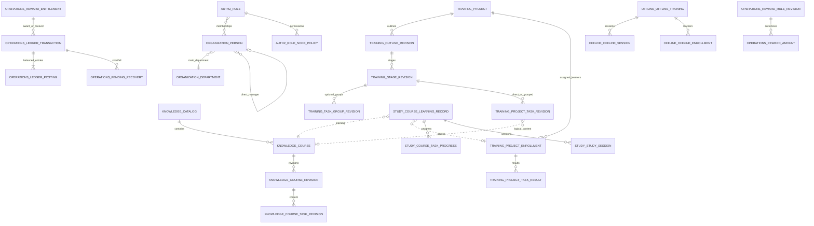

# 数据库 Schema 设计

版本：技术设计定稿 v1.0　更新：2026-09-23　范围：Path A 全范围

本文件是供技术评审的数据库设计，不是 DDL、迁移脚本或已经实现的数据库。业务输入不作修改。字段、索引、事务与模块归属是本轮技术设计；业务裁定见T-01～19，承载性须后续验证，不能作为原站实现事实。

## 1. 依据、边界与决策级别

按需使用以下业务输入：

- `交接说明_v8.3.md`：Path A、D-36 模块边界、D-31/32/34/41 预留、D-42、B4-16 先于 B4-14、五层时效、永久缺口。
- `02_规划交付物/交付物5_业务对象与指标字典.md`：对象、字段、关系、来源、时长与指标定义。
- `02_规划交付物/交付物4_需求基线.md`：ORG/ROLE/CAT/CRS/PRJ/INC/CHG/ASN/STU/REC/RPT/FTF/GLOBAL 相关条目。
- 本轮用户确认：方案 A（Vue 3、TypeScript、Element Plus、NestJS/Fastify、PostgreSQL、Redis、对象存储/CDN）；课程默认每任务发分；追回余额最低为 0，不足部分为待抵扣；团队管理仅以“直属经理 = 本人”判定，报表权限按节点选择六范围。

覆盖组织人员、权限、分类课程、课件、学习记录、培训项目及三层大纲、指派、项目任务、面授、激励账务、大纲生效、最小报表和站内通知。不是仅前三批的 Schema。**本文件列出的是全 Path A 分批迁移设计，不要求在 B1 一次性创建所有表。**各批次只创建其交付能力与前置依赖所需结构；必须提前具备的预留随对应基础能力建立，例如 B3 首次发奖即使用可追溯账本，B4-16 先于 B4-14。

本期仅启用学分；积分的值集合、基础/优秀两档、四条扣减配置必须具备。企课堂、兼职部门/岗位、带教、学习轮次、评优事件等只保留关系，不自动开放对应产品功能。考试、调查、通用审批、培训规划、积分商城、外部游客、飞书/钉钉和北森同步不因建模而进入本期范围。

**原站与目标设计严格区分：**草稿/生效分离有原站证据；D-42 的回退、追回及正向补发是目标产品决策或推导，不能称为“原站一致”。G-01（学员真实可见范围）、G-02（实际越权表现）、G-04（讲师边界）、G-05（历史数据重算）、G-06（原站课程级聚合）永久保留。T-10逐任务计算由我方定义，原站课程级聚合从未验证，不能称为“与原站一致”。G-03 已结案，不再列永久缺口。

## 2. 全库约定

### 2.1 技术与租户边界

| 项目 | 设计 |
|---|---|
| 数据库 | PostgreSQL，具体主版本上线前固定；ORM 建议 Drizzle，模式变更建议显式 SQL 迁移并评审；本文件不生成实现 |
| 部署边界 | T-07：一个企业站点；内部及客户员工使用正式账号；客户人员与学习数据按公司隔离，内部管理员按授权跨客户管理 |
| 站点字段 | 业务表均含 `tenant_id uuid NOT NULL`，当前单个固定站点；是数据隔离防线和未来迁移键，不代表已实现 SaaS 多租户 |
| 公司边界 | organization.company属于站点，客户公司不等于独立tenant。人员当前公司和学习事实当时公司分别保存；同项目共享内容不消除公司数据范围。不建设客户独立数据库/计费/租户路由 |
| ID | E-02：UUID v4由服务端生成，API按字符串传输。业务编号、账号和原站ID另列；分区学习上报采用明确的复合主键，见§8及09 |
| 类型 | 金额 `numeric(18,4)`，比例 `numeric(9,6)`，时长 `numeric(18,3)` 秒；计数 `bigint`；不使用浮点金额 |
| 时间 | 事件和起止时间 `timestamptz`，内部 UTC；业务日期与次日 02:00 按 `Asia/Shanghai`。纯入职日期、统计日期用 `date` |
| 展示 | 时长存秒，展示分钟；学分展示小数位、舍入模式和保底粒度需随规则版本记录，不能由页面各自四舍五入 |
| 字符串 | 有已知业务上限的名称用 `varchar(n)`；正文 `text`；富文本内容保存清洗后的受控格式；不存任意可执行 HTML |
| 枚举 | 业务代码用 `text` 加字典/校验白名单；可扩展权限主体、动作、币种用字典表，避免 PostgreSQL enum 改类型才能加值 |
| JSONB | 限于经过版本化校验的配置、审计前后值、固定表单答案和不可变快照；关系、金额、时间窗、查询条件关键字段不塞进无约束 JSON |
| 文件 | 只存对象存储键、摘要、元数据和处理状态；访问时经权限校验签发短期地址，不持久化公开永久 URL 或签名 URL |
| Redis | 缓存、短期会话、防并学租约、节流、任务调度辅助；学习事实、余额、待抵扣和幂等事实以 PostgreSQL 为准 |

### 2.2 字段符号与公共字段

下列表中 `!` 表示 `NOT NULL`，`?` 表示允许 NULL。未另列的每张业务表都具有公共字段，复合键关系表可用复合主键替代 `id`；站点根表 `organization.tenant_context` 自身无需重复 `tenant_id`。`U(...)` 表示唯一约束，`I(...)` 表示普通 B-tree 索引，`P(...)` 表示部分索引。所有 U/I 默认以 `tenant_id` 为首列，后文省略它。

| 字段 | 类型 / NULL | 规则 |
|---|---|---|
| `id` | uuid ! | 主键，稳定身份；同时建立 `U(tenant_id,id)` 供站点内组合关联 |
| `tenant_id` | uuid ! | 来自可信服务上下文，不接受请求体自行声明；所有查询、关联和幂等键带站点 |
| `created_at` | timestamptz ! | 服务端时间；历史导入保留另一个 `source_occurred_at`，不伪造系统创建时间 |
| `created_by` | uuid ? | 人员逻辑引用；系统作业为空，并另记服务身份 |
| `updated_at` | timestamptz ! | 服务端时间；不可变事实等于创建时间 |
| `updated_by` | uuid ? | 人员逻辑引用 |
| `row_version` | bigint ! | 默认 1，每次修改递增；用于乐观锁，不能替代数据库事务 |
| `deleted_at` | timestamptz ? | 仅可软删的配置/目录表使用；事实、账本、生效版本不软删，采用追加更正 |

人员“删除”用显式 `status=deleted` 并记录 `deleted_at`；恢复不重建 ID。稳定账号唯一键**不排除软删**，避免删号后复用账号污染历史。其他业务编码按各实体所列唯一约束校验；恢复时不改账号、不覆盖另一实体，发生冲突则返回字段错误供管理员处理。

关键索引均为设计起点，真实数据量下用查询计划验证。权限可见集合先约束查询范围，再分页；不能取全量后在前端过滤。5 万人名册采用服务端筛选和游标分页，不能依赖客户端一次性加载。

### 2.3 模块所有权与关联

| PostgreSQL schema / 模块 | 持有事实 | 其他模块的访问方式 |
|---|---|---|
| `organization` | 人、组织、岗位、人员快照、标签词表与人员标签 | 组织查询/变更公开接口与事件 |
| `authz`（支撑） | 角色、节点、操作、范围、覆盖和任命授权索引 | 集中授权策略；业务模块提供对象关系事实 |
| `knowledge` | 分类、课程、课程任务、课件引用、内容版本 | 内容及可见性接口 |
| `training` | 项目、大纲、项目任务、指派、项目学员及完成状态 | 项目/指派/结果/生效接口 |
| `study` | 学习入口、会话、行为、课程进度、课程完成、时长 | 学习事实接口与事件 |
| `offline` | 面授、场次、考勤、请假、成绩、固定评价、学时核实 | 面授结果和时长接口 |
| `operations` | 学习动作计时策略、激励规则、账本、待抵扣、激励结算与对账 | 策略与激励公开接口 |
| `report` | 来源事实投影、当前人员投影、聚合及导出 | 消费已定义事件/接口；不直接 JOIN 业务模块表 |
| `messaging`（支撑） | 站内消息、收件人、发送去重 | 站内消息服务；不复用账务表 |
| `identity` / `files` / `jobs` / `audit`（platform下独立支撑模块） | 登录身份与会话 / 文件资产 / 通用作业 / 审计 | 各自公开接口；属于同一模块化单体，不塞入激励operations |
| `platform`（公共基础设施schema） | 请求幂等、outbox、inbox | 事务与可靠消息支撑接口；不持有业务完成或奖励规则 |

**建议采用模块内物理外键、跨模块逻辑 ID。**模块内外键包含 `tenant_id`，删除默认 RESTRICT。跨模块 ID 在创建/变更时经持有模块公开接口校验，并由审计和一致性巡检发现失效引用；软删不能删除被历史事实引用的对象。`college_id` 在 knowledge 内是物理外键；`person_id`、跨模块 `course_id`、`mentorship_id` 等为逻辑外键。此策略是便于拆分的技术建议，不是原站事实。

同库事务通过公开模块服务参加一个 `UnitOfWork`，连接由基础设施管理；编排层不得直接读写其他模块表。跨模块事务不等于开放跨模块仓储。事件负载带 `event_id/tenant_id/aggregate_id/aggregate_version/occurred_at/schema_version`，消费者只保存其业务需要的投影。

## 3. 核心关系图

虚线关系为跨模块逻辑关联；同模块关系在后续表定义中约束。

`course_task` 指课程内部文档/视频单元；`project_task` 指项目大纲里的知识、面授、考勤、活动或作业任务。两者不得共用一个含混的 `task` 表，也不得仅凭同一 UUID 字段推断任务族。

## 4. organization：人员、组织与历史快照

下表每行是一张表；表名的 schema 即其唯一持有模块。

| 表 | 主要字段（类型与 NULL） | 唯一 / 索引 / 关联与约束 |
|---|---|---|
| `organization.tenant_context` | `name varchar(200)!`，`business_timezone text!`，`status text!` | 本期仅一个启用站点；无跨租户业务管理能力 |
| `organization.company` | `name varchar(200)!`，`kind text!`，`status text!` | `I(kind,status,name,id)`；kind internal/customer；公司属于当前tenant；内部主体与客户公司同一维度表达，不用自由文本作隔离键 |
| `organization.department` | `company_id uuid!`，`parent_id uuid?`，`name varchar(200)!`，`depth smallint!`，`sort_order int!`，`status text!` | FK company及同公司父部门；`I(parent_id,sort_order,id)`；深度 1–20；禁止环；人数为派生值，不把有歧义人数存为真值 |
| `organization.department_closure` | `ancestor_id uuid!`，`descendant_id uuid!`，`distance smallint!` | `U(ancestor_id,descendant_id)`，`I(descendant_id,ancestor_id)`；同模块双 FK；节点自身距离 0；移动组织同事务维护闭包 |
| `organization.position` | `name varchar(100)!`，`code varchar(64)?`，`status text!` | `U(code)`（非空），`I(status,name,id)` |
| `organization.person_group` | `name varchar(100)!`，`mode text!`，`status text!`，`active_rule_revision_id uuid?`，`membership_version bigint!` | `I(status,name,id)`；static/dynamic；DIFF-15及B2-13要求的用户组归组织模块；动态组只维护人员集合，不自行指派项目 |
| `organization.person_group_rule` | `group_id uuid!`，`revision_no bigint!`，`expression jsonb!`，`effective_from timestamptz!` | FK group，`U(group_id,revision_no)`；版本化白名单表达式，最小组规则使用部门/岗位/入职时间与AND/OR；不接收SQL，不新增标签指派或递归组规则引擎 |
| `organization.person_group_member` | `group_id uuid!`，`person_id uuid!`，`source_type text!`，`rule_revision_id uuid?`，`membership_version bigint!`，`valid_from timestamptz!`，`valid_to timestamptz?` | 同模块group/person FK；`P U(group_id,person_id) WHERE valid_to IS NULL`、`I(person_id,valid_to,id)`；人工维护或规则求值产生；保留成员变更版本，向training发布组变更，不直写项目表 |
| `organization.person` | `account varchar(128)!`，`display_name varchar(200)!`，`employee_no varchar(100)?`，`company_id uuid!`，`person_kind text!`，`customer_company_name varchar(200)?`，`phone_country_code varchar(8)?`，`phone_number varchar(32)?`，`email varchar(254)?`，`main_department_id uuid!`，`position_id uuid?`，`direct_manager_id uuid?`，`joined_on date?`，`status text!`，`account_expires_at timestamptz?`，`job_grade_code varchar(100)?`，`extension_attributes jsonb?` | `U(account)`；`I(company_id,status,id)`；主部门/岗位/直属经理本模块 FK；`I(main_department_id,status,id)`、`I(direct_manager_id,status,id)`、`I(position_id,status,id)`、`I(joined_on,id)`；账号创建后不可改；状态 enabled/disabled/deleted；person_kind employee/customer；客户人员也须明确平台主部门；job_grade_code对应原业务“职级”、extension_attributes对应“扩展字段”，均可空预留，本期不启用职级体系或HR扩展字段配置 |
| `organization.person_private` | `person_id uuid!`，`national_id_ciphertext bytea?`，`key_version text?`，`face_auth_status text?`，`preferred_language text?` | `U(person_id)`、FK person；身份证、人像当前不启用；密文与访问审计预留，不将其复制到学习/报表 JSON |
| `organization.person_secondary_department` | `person_id uuid!`，`department_id uuid!`，`valid_from timestamptz!`，`valid_to timestamptz?` | 两个模块内 FK，`U(person_id,department_id,valid_from)`；预留，V1 不计人数、不开放维护入口 |
| `organization.person_secondary_position` | `person_id uuid!`，`position_id uuid!`，`valid_from timestamptz!`，`valid_to timestamptz?` | 同上，兼职岗位预留 |
| `organization.person_snapshot` | `person_id uuid!`，`company_id uuid!`，`company_name text!`，`captured_at timestamptz!`，`person_row_version bigint!`，`account varchar(128)!`，`display_name varchar(200)!`，`department_id uuid!`，`department_name text!`，`department_path jsonb!`，`position_id uuid?`，`position_name text?`，`status_at_capture text!` | 不可变；`U(person_id,person_row_version)`；`I(person_id,captured_at)`；path 为 ID+名称有序数组，保留当时组织树；学习事实保存 snapshot_id，不覆盖旧快照 |
| `organization.person_change` | `person_id uuid!`，`change_type text!`，`before_snapshot_id uuid?`，`after_snapshot_id uuid!`，`changed_at timestamptz!` | FK 本模块快照；`I(person_id,changed_at,id)`；供当前状态投影更新及调岗追溯 |
| `organization.tag` | `name varchar(100)!`，`normalized_name varchar(100)!`，`merged_into_id uuid?` | `U(normalized_name)`、FK merged_into；自由文本回车创建，相似词检索建议 trigram 索引；不擅自改为受控词表 |
| `organization.tag_merge` | `from_tag_id uuid!`，`to_tag_id uuid!`，`merged_at timestamptz!`，`reason text?` | `U(from_tag_id)`；不允许自合并/循环；本模块事务迁移人员标签，向knowledge发送映射事件更新课程标签引用，保留来源 |
| `organization.person_tag` | `person_id uuid!`，`tag_id uuid!`，`source_type text!`，`source_id uuid!`，`source_event_id uuid!`，`granted_at timestamptz!` | person/tag 均为本模块物理 FK；`U(person_id,tag_id,source_type,source_id)`、`U(source_event_id,person_id,tag_id)`；保留不同授予来源，标签合并在organization事务中迁移映射 |

人员允许主管为空；不允许本人作为自己的直属经理。是否进一步禁止经理链闭环建议校验，但团队业务查询始终只匹配 `direct_manager_id=actor.id`，**不递归经理链、不以部门闭包代替直属团队**。报表六范围中的部门树查询与团队查询是不同策略。

T-07/T-15公司约束：person.company_id为同模块FK，person_kind须与company.kind一致，customer_company_name仅作显示缓存。主部门必须与人员同公司，组织树禁止跨公司父子关系；各公司在站点根下并列。person_snapshot的公司、部门与姓名均为不可变快照。跨公司变更需有两边公司管理权限并预览影响，递增权限版本、结束旧公司学习会话并重新核对管理授权；旧事实不改公司、不复用为新公司学习记录。新公司关联按新公司建立，回到原公司也不能借此重发旧来源奖励。

人员当前状态过滤和历史归属必须分离：例如“按上月部门汇总、只看当前启用人员”使用历史快照的部门路径分组，再用当前状态投影过滤；不能用当前部门回写历史，也不能拿快照里的 enabled 推断该人今天可登录。

## 5. authz：集中三维权限与可扩展主体

| 表 | 主要字段（类型与 NULL） | 唯一 / 索引 / 关联与约束 |
|---|---|---|
| `authz.role` | `code text!`，`name varchar(100)!`，`level smallint!`，`kind text!`，`description text?`，`is_system boolean!` | `U(code)`；level 1/2/3；1 级仅系统预置，新建仅 2/3；本期种子角色管理员/主管/学员 |
| `authz.person_role` | `person_id uuid!`，`role_id uuid!`，`assigned_at timestamptz!`，`revoked_at timestamptz?` | FK role；`P U(person_id,role_id) WHERE revoked_at IS NULL`；人员多角色；`I(role_id,revoked_at,person_id)` |
| `authz.function_node` | `code text!`，`parent_id uuid?`，`module_code text!`，`name text!`，`scope_dimension text!`，`self_anchor_code text!`，`supported_scope_codes jsonb!` | `U(code)`，FK 自树；节点决定支持的资源维度，不假定商品范围等也是人员范围 |
| `authz.action` | `code text!`，`name text!`，`kind text!`，`sensitive_field text?` | `U(code)`；kind operation/field；手机号、邮箱、身份证读取是不同动作，按节点授权 |
| `authz.node_action` | `node_id uuid!`，`action_id uuid!` | `U(node_id,action_id)`，双 FK；白名单控制可配动作 |
| `authz.role_node_policy` | `role_id uuid!`，`node_id uuid!`，`navigation_visible boolean!`，`scope_code text!`，`policy_version bigint!` | `U(role_id,node_id)`，双 FK；三维中的导航与数据范围独立；六范围代码见下文 |
| `authz.role_node_action` | `role_node_policy_id uuid!`，`action_id uuid!` | `U(role_node_policy_id,action_id)`，FK；操作权限为集合，不能单个 can_manage 代替 |
| `authz.policy_department` | `role_node_policy_id uuid!`，`department_id uuid!`，`include_descendants boolean!` | `U(role_node_policy_id,department_id)`；指定部门使用；department 逻辑 ID；T-16：include_descendants默认false，显式true才含下级 |
| `authz.person_jurisdiction` | `person_role_id uuid!`，`person_id uuid!`，`role_id uuid!`，`target_type text!`，`target_id uuid!`，`include_descendants boolean!` | `U(person_role_id,target_type,target_id)`；FK person_role，冗余person/role必须与该有效成员关系一致；三级中的人员级管辖范围；支持部门主体，其他维度未启用 |
| `authz.person_node_override` | `person_role_id uuid!`，`person_id uuid!`，`role_id uuid!`，`node_id uuid!`，`scope_code text!`，`policy_version bigint!` | `U(person_role_id,node_id)`；FK person_role，冗余person/role校验一致；三级中的单人覆盖，仅覆盖对应角色和节点，不擅自全局覆盖其他角色 |
| `authz.override_department` | `override_id uuid!`，`department_id uuid!`，`include_descendants boolean!` | `U(override_id,department_id)`，FK override；部门逻辑 ID |
| `authz.subject_type` | `code text!`，`resolver_code text!`，`enabled boolean!` | `U(code)`；扩展主体字典：super_admin/creator/person、预留 classroom_admin/classroom_member；新增同类主体数据不改分类查询逻辑 |
| `authz.object_appointment` | `person_id uuid!`，`owner_module text!`，`object_type text!`，`object_id uuid!`，`appointment_type text!`，`source_event_id uuid!`，`effective_at timestamptz!`，`revoked_at timestamptz?` | `P U(person_id,object_type,object_id,appointment_type) WHERE revoked_at IS NULL`；对象事实由持有模块维护，此表是同步授权索引；取消任命不能等待 10 分钟 |
| `authz.person_company_grant` | `person_id uuid!`，`company_id uuid!`，`granted_by uuid!`，`granted_at timestamptz!`，`revoked_at timestamptz?` | `P U(person_id,company_id) WHERE revoked_at IS NULL`；公司/人员逻辑引用；仅内部人员可获跨客户管理范围，授予者须有对应公司管理及转授能力；变更同步递增权限版本 |
| `authz.delegation_provenance` | `target_type text!`，`target_id uuid!`，`grantor_person_role_id uuid?`，`system_origin text?`，`authority_snapshot jsonb!`，`source_authz_revision bigint!`，`validation_state text!` | `U(target_type,target_id)`；FK grantor_person_role；成员上下文/系统预置来源二选一；active/recheck_required/suspended；权限缩小或组织变化同事务使依赖授权待重验，中央策略拒绝未复核项；禁止循环转授依赖 |
| `authz.tenant_authorization_revision` | `revision bigint!`，`changed_at timestamptz!` | `U(tenant_id)`；租户粗粒度权威版本；所有授权变更与该版本递增同事务；每请求经authz读取权威版本，不能靠缓存TTL延迟撤权 |
| `authz.authorization_revision` | `person_id uuid!`，`person_authz_version bigint!`，`changed_at timestamptz!` | `U(person_id)`；人员版本仅预留细粒度缓存优化，当前不代替租户权威版本；角色/覆盖/任命/管辖变更使缓存失效 |

六范围代码：`all`（站点全部）、`own_department_tree`、`own_department`、`specified_departments`、`jurisdiction`、`self`。每个节点独立配置。T-05已确认：在各角色/节点内解析范围与人员参数并应用对应单人覆盖，再合并同节点、同动作的有效授权；覆盖不收窄其他角色。权限来源、动作与范围成组保留，不把查看全部的数据范围移给编辑动作。

T-06已确认：有效项目负责人任命经中央策略派生管理后台入口、培训中心对应导航与对象能力，范围为该人员被任命的项目集合。`training`拥有任命事实，`authz.object_appointment`保存同步索引；派生能力通过任命类型的集中导航/动作映射得到，不复制成永久全局管理员角色。任命的新增/撤销与权限版本递增同事务。无其他后台授权且最后一项任命撤销时关闭管理入口；其他角色或其他项目任命仍按来源保留。

T-07公司上限与T-05角色并集取交集：客户人员只能管理本公司人员/学习事实；内部人员以本人公司加有效person_company_grant确定公司范围，跨客户能力仍须相应节点/动作或任命。授权范围为全部数据也不能越过此公司上限。人员页面用当前company_id；学习/报表页面用事实data_company_id，历史公司归属不跟随调岗改写。站点超管的公司范围由初始化/公司管理流程显式维护，不从角色名称猜测权限。

T-16参数与转授约束：人员管辖归属具体person_role成员关系，仅scope=jurisdiction时解析；独立覆盖存在且指定集合为空时为无授权，删除覆盖才回到角色继承。授权请求必须选择有效的管理角色成员上下文，节点/动作/字段/集合均不得超出该上下文可转授能力；任命不自动进入可转授集合，1级预置角色不经普通界面修改。依赖上级授权的配置记录来源并在源权限/组织变更时同步失效，重新验证前不放行。

范围语义由集中authz的`PolicyCompiler`解释，包括六范围、三级覆盖与经裁决的多角色规则；业务模块只把编译结果映射为自己表的列/关系，不能各自解释“本部门”或重新合并角色。组织成员事实由`OrganizationPublic.resolveScopeMembers`解析，集中授权请求可得到站点内被许可的人员/部门关系。报表请求先当次授权，再将该许可关系与report自身事实作筛选；禁止report直接JOIN organization/authz表，也不能把导出时保存的旧许可集合永久当权限。新增主体通过统一resolver注册，不在每条课程查询中增加分支。新业务语义仍可能需要新resolver，不能承诺任意主体完全零代码。

本期推荐缓存键含 `tenant_id+actor_id+authzRevision`（其中authzRevision取`authz.tenant_authorization_revision.revision`）。每请求先通过authz公开接口取得数据库权威租户版本再使用缓存；人员状态、角色/节点范围、单人覆盖、对象任命与相关分类授权变更都应同事务递增该版本。任何仅更新person版本但不更新租户版本的路径都属于撤权缺陷；发布前以并发越权场景验证。后续若要减少每请求查询需另审强一致失效方案，不能未经评审改成分钟级TTL。

越级授权检查不仅检查角色等级，还检查授予者实际拥有的节点、动作、数据范围上限。敏感字段在接口序列化与导出列选择两处检查，禁止“界面打码但 CSV 明文”。超管与角色并行的原站语义尚有限制，本期不从角色名自动获得超管权限。

## 6. knowledge：分类、课程、课程任务与版本

### 6.1 分类与内容实体

| 表 | 主要字段（类型与 NULL） | 唯一 / 索引 / 关联与约束 |
|---|---|---|
| `knowledge.college` | `name varchar(200)!`，`code text!`，`status text!` | `U(code)`；只预置“主课堂”，不交付企课堂管理能力 |
| `knowledge.catalog` | `name varchar(50)!`，`parent_id uuid?`，`college_id uuid?`，`depth smallint!`，`creator_id uuid!`，`is_public boolean!`，`inherit_parent boolean!`，`force_children_inherit boolean!`，`permission_revision bigint!` | FK catalog/college；`I(parent_id,id)`；深度≤10；college 预留且可指向主课堂；无环 |
| `knowledge.catalog_closure` | `ancestor_id uuid!`，`descendant_id uuid!`，`distance smallint!` | `U(ancestor_id,descendant_id)`，反向索引；权限传播、公开级联和分类移动共用树事实 |
| `knowledge.catalog_grant` | `catalog_id uuid!`，`subject_type_code text!`，`subject_id uuid?`，`action_code text!`，`origin_catalog_id uuid?` | `U(catalog_id,subject_type_code,subject_id,action_code)` 使用 NULLS NOT DISTINCT 或等价唯一设计；FK catalog；主体/动作由 authz 接口校验；动作 browse/maintain/distribute/download，预留 app_cache |
| `knowledge.resource` | `name varchar(200)!`，`resource_type text!`，`active_revision_id uuid?`，`uploader_id uuid!`，`status text!` | `I(resource_type,status,created_at,id)`；课件稳定实体，resource_type document/video；API统一称resource，与底层二进制asset分开 |
| `knowledge.resource_revision` | `resource_id uuid!`，`revision_no bigint!`，`asset_id uuid!`，`asset_revision_id uuid!`，`standard_duration_seconds numeric(18,3)!`，`completion_method text!`，`completion_threshold numeric(9,6)!`，`processing_status text!`，`metadata jsonb!` | `U(resource_id,revision_no)`；FK resource；asset为files逻辑ID；视频标准时长来自处理元数据，不能手填；文档标准时长可为0，学分仍依保底策略；completion_method由类型派生，threshold为(0,1] |
| `knowledge.course` | `business_code varchar(100)?`，`business_number varchar(100)?`，`catalog_id uuid!`，`college_id uuid?`，`publication_status text!`，`active_revision_id uuid?`，`draft_revision_id uuid?`，`contributor_id uuid!`，`uploader_id uuid!`，`uploader_snapshot_id uuid!` | FK catalog/college/revision；`I(catalog_id,publication_status,id)`；编码与编号分别保存；draft/published/withdrawn；贡献者与上传者不合并 |
| `knowledge.course_revision` | `course_id uuid!`，`revision_no bigint!`，`base_revision_id uuid?`，`state text!`，`title varchar(200)!`，`description varchar(2000)?`，`display_version varchar(50)?`，`cover_asset_id uuid?`，`hidden boolean!`，`visibility_mode text!`，`comment_enabled boolean!`，`prevent_seek_before_completion boolean!`，`speed_duration_enabled boolean!`，`standard_duration_seconds numeric(18,3)!`，`reward_policy_revision_id uuid?`，`published_at timestamptz?` | `U(course_id,revision_no)`；draft/effective/superseded；生效版本不可原位覆盖；visibility inherit_catalog/custom；时长由课件聚合，视频不可手填 |
| `knowledge.course_grant` | `course_revision_id uuid!`，`subject_type_code text!`，`subject_id uuid?`，`action_code text!` | 同 catalog_grant 的空值唯一处理；仅自定义浏览覆盖生效；不能借此赋予课程维护/分发越级权限 |
| `knowledge.course_task` | `course_id uuid!`，`stable_code text?` | FK course；课程内稳定任务身份，跨版本保留 |
| `knowledge.course_task_revision` | `course_revision_id uuid!`，`course_task_id uuid!`，`task_type text!`，`title varchar(200)!`，`resource_id uuid!`，`resource_revision_id uuid!`，`standard_duration_seconds numeric(18,3)!`，`completion_threshold numeric(9,6)!`，`requirement_type text!`，`counts_toward_progress boolean!`，`participates_in_unlock boolean!`，`sort_order int!`，`reward_rule_revision_id uuid?` | `U(course_revision_id,course_task_id)`、`U(course_revision_id,sort_order)`；FK revision/task/resource及其版本；task_type document/video；requirement required/optional，预留 dynamic；三个属性独立；奖励为逻辑 ID |
| `knowledge.course_tag` | `course_revision_id uuid!`，`tag_id uuid!` | `U(course_revision_id,tag_id)`，course_revision物理FK、tag为organization逻辑ID；发标签时保存当时生效版本 |
| `knowledge.course_attachment` | `course_revision_id uuid!`，`asset_id uuid!`，`display_name text!`，`sort_order int!` | `U(course_revision_id,sort_order)`；上限50仅在附件功能启用后执行；当前预留，不绕过分类下载授权 |
| `knowledge.course_related_person` | `course_revision_id uuid!`，`person_id uuid!`，`relation_type text!` | `U(course_revision_id,person_id,relation_type)`；作者/主讲/辅讲/审核人预留；作者启用时上限10；本期不建立讲师后台、审核流程 |

### 6.2 草稿与生效约束

课程稳定 ID 与内容版本分离；读取学习内容只取 `active_revision_id`，编辑只写草稿。一个对象最多一个可编辑草稿，保存草稿不改变学员版本。技术建议采用“基础必填先满足”的草稿：显式保存时要求名称和分类，课程任务可以尚未添加；完整发布校验要求所有已添加任务及资源满足上述非空约束。若产品要求连名称/分类均未填也能持久化草稿，应另行评审独立草稿载荷表，不能绕过当前非空约束。**首次进入页面或退出页面不创建 course**，显式保存才创建。

课程任务更换资产版本和项目任务改挂内容是不同变化：前者是同一稳定内容ID的修订，后者按D-42的删除/替换契约执行。知识修订本身不触发项目奖追回，也不重发既得课程学分；只有显式项目大纲内容替换命令进入影响预览与D-42生效事务。若以后希望普通版本更新也触发追回，属于业务变更，不能由监听asset_revision变化自行启用。

分类公开级联和继承锁定在同事务内写树及权限版本；继承节点只读，不能保留一份可悄悄生效的本地权限。若保留历史本地配置用于审计，它必须标为 inactive。分类创建者权限保留原始创建者身份，不随最后编辑者变化。T-16：force_children_inherit锁定同样约束创建者及课程浏览覆盖；允许独立设置时，课程自定义浏览集合替换继承集合，但受操作者可转授上限约束，不顺带获得维护/分发/下载。

T-12：文档发布要求files返回ready且page_count>0，并固定可读页清单及资产版本；标准时长允许0，不用0秒替代页数完成标准。转换失败、无可读页、未就绪资产均拒绝发布。

课程下架通过公开模块服务检查在学影响人数并确认，随后阻止新学习请求；重新上架沿用稳定 ID 与既有记录。下架不删除账本、进度或历史版本。

## 7. training：项目、三层大纲与指派

### 7.1 项目与版本化大纲

| 表 | 主要字段（类型与 NULL） | 唯一 / 索引 / 关联与约束 |
|---|---|---|
| `training.project_category` | `name varchar(100)!`，`parent_id uuid?` | FK 自树；项目分类不能误用课程 catalog 的维护权限 |
| `training.project_time_policy_revision` | `revision_no bigint!`，`maximum_project_years smallint!`，`state text!`，`effective_from timestamptz!` | `U(revision_no)`（含tenant_id）；每站点最多一个effective版本；maximum_project_years为正整数且≤5，当前配置2；归training持有，历史策略版本不可覆盖 |
| `training.project` | `number varchar(50)!`，`name varchar(200)!`，`category_id uuid?`，`cover_asset_id uuid?`，`description text?`，`status text!`，`archived_at timestamptz?`，`time_mode text!`，`starts_at timestamptz?`，`ends_at timestamptz?`，`period_days int?`，`time_policy_revision_id uuid?`，`completion_mode text!`，`sync_course_progress boolean!`，`auto_end boolean!`，`auto_graduate boolean!`，`allow_manager_manage_learners boolean!`，`active_outline_revision_id uuid?`，`draft_outline_revision_id uuid?`，`write_epoch bigint!`，`enrollment_gate text!` | `U(number)`、`I(status,ends_at,id)`；time_mode fixed/relative；fixed要求起止与time_policy_revision_id，按站点配置校验跨度（当前2年，配置最大5年），不硬编码≤2年；relative要求正周期；completion_mode all_required/all_tasks；enrollment_gate为open/no_completion_tasks，随生效大纲原子更新；项目结束、归档分开；说明≤10000字 |
| `training.project_owner` | `project_id uuid!`，`person_id uuid!`，`is_creator boolean!`，`revoked_at timestamptz?` | FK project；`P U(project_id,person_id) WHERE revoked_at IS NULL`；多人负责人，授权变更调用 authz；person 逻辑 ID |
| `training.outline_revision` | `project_id uuid!`，`revision_no bigint!`，`base_revision_id uuid?`，`state text!`，`content_hash text!`，`reward_configuration_revision bigint!`，`effective_at timestamptz?`，`activation_id uuid?` | `U(project_id,revision_no)`；draft/preparing/effective/superseded/cancelled；effective 内容不可变；项目只暴露一个生效指针 |
| `training.stage` | `project_id uuid!` | FK project；稳定阶段身份，重排不换 ID |
| `training.stage_revision` | `outline_revision_id uuid!`，`stage_id uuid!`，`name varchar(200)!`，`description text?`，`sort_order int!`，`starts_at timestamptz?`，`ends_at timestamptz?`，`reward_rule_revision_id uuid?` | `U(outline_revision_id,stage_id)`、`U(outline_revision_id,sort_order)`；模块内双 FK；奖励逻辑 ID；阶段时间影响规则未明时不增加隐式第四层可学时间门槛 |
| `training.task_group` | `project_id uuid!` | FK project；稳定分组身份，无奖励 |
| `training.task_group_revision` | `outline_revision_id uuid!`，`task_group_id uuid!`，`stage_id uuid!`，`name varchar(200)!` | `U(outline_revision_id,task_group_id)`；组合 FK 指向同一大纲的 stage_revision；分组只归属一个阶段 |
| `training.project_task` | `project_id uuid!` | FK project；稳定项目任务身份，是 D-42 删除/替换追溯锚点 |
| `training.project_task_revision` | `outline_revision_id uuid!`，`project_task_id uuid!`，`stage_id uuid!`，`task_group_id uuid?`，`task_type text!`，`name varchar(200)!`，`content_type text!`，`content_id uuid!`，`content_revision_id uuid?`，`requirement_type text!`，`counts_toward_progress boolean!`，`participates_in_unlock boolean!`，`starts_at timestamptz?`，`ends_at timestamptz?`，`reward_rule_revision_id uuid?` | `U(outline_revision_id,project_task_id)`；父阶段/分组须属于同一大纲且同一阶段；内容逻辑引用；required/optional，预留 dynamic；task_type 与 content_type 不混为任务族；时间为空不写虚构日期 |
| `training.outline_order_item` | `outline_revision_id uuid!`，`stage_id uuid!`，`parent_group_id uuid?`，`item_kind text!`，`item_id uuid!`，`sort_order int!` | `U(outline_revision_id,parent_group_id,stage_id,sort_order)` 采用 NULLS NOT DISTINCT；`U(outline_revision_id,item_kind,item_id)`；item_kind group/task；阶段直挂任务和分组可混排；分组下不允许再嵌分组；发布前接口验证对象存在与父链一致 |
| `training.project_task_definition` | `project_task_id uuid!`，`definition_revision bigint!`，`definition_kind text!`，`instructions text?`，`attachment_asset_ids jsonb!`，`qualification_mode text!` | `U(project_task_id,definition_revision)`；承载 Path A 活动/作业/独立考勤的最小定义；课程、面授引用其专属模块；合格判定不是提交即完成；不扩成通用考试/问卷引擎 |

项目任务类型字典使用九类原站类型名：考勤、活动、投票、文档、面授、作业、考试、调查、鉴定；本期仅启用 Path A 的考勤/活动/文档（可承载 knowledge 课程）/面授/作业。视频是课程任务类型，不能因此新增“项目视频任务族”。同一知识课程被多个项目引用时有不同 project_task 稳定 ID。

固定期限发布/变更时，经TrainingPublic读取当前有效`project_time_policy_revision`并校验end>start且跨度不超过站点配置的日历年上限；按业务时区处理日历年边界，当前2年、可配置最大5年。项目绑定所用策略版本，后续修改站点配置不无声改写已发布项目期限；再次改期时按当前有效策略重新校验。数据库保留合法起止及策略FK约束，不能写死固定期限≤2年；相对周期不自动套用未经确认的固定期限上限。

T-08：项目有固定起止边界时，任务非空起止必须在项目区间内，草稿保存/复制后保存/发布均由training服务校验并返回字段错误；不采用黄色警告放行。任务空端点继承上层。周期模式不存在可比较的全局绝对区间，不伪造项目日期；建立/调整学员计划时用真实起止复核可学交集，明确报告无法在周期内安排的任务。运行时仍检查三层交集，不由“保存成功”永久放行。

### 7.2 指派与学习关联

| 表 | 主要字段（类型与 NULL） | 唯一 / 索引 / 关联与约束 |
|---|---|---|
| `training.assignment_rule` | `project_id uuid!`，`revision_no bigint!`，`combine_mode text!`，`enabled boolean!`，`scheduled_local_time time!`，`effective_from timestamptz!` | `U(project_id,revision_no)`；AND/OR；规则不直接写任意 SQL |
| `training.assignment_condition` | `rule_id uuid!`，`dimension text!`，`operator text!`，`department_id uuid?`，`position_id uuid?`，`group_id uuid?`，`date_from date?`，`date_to date?`，`relative_days int?` | FK rule；department/position/group/joined_on四维已纳入本期；group逻辑引用经OrganizationPublic校验；每种dimension校验唯一合法参数形状；无标签维度 |
| `training.project_group_binding` | `project_id uuid!`，`group_id uuid!`，`binding_revision bigint!`，`last_membership_version bigint!`，`state text!`，`joined_at timestamptz!`，`detached_at timestamptz?` | FK project；group逻辑引用；`P U(project_id,group_id) WHERE detached_at IS NULL`；组变更按版本应用，失序补快照；T-14：退出组只撤本来源，最后有效来源消失才结束关联 |
| `training.enrollment_source` | `enrollment_id uuid!`，`source_type text!`，`source_id uuid!`，`source_version bigint!`，`operator_id uuid?`，`active_from timestamptz!`，`active_to timestamptz?` | FK enrollment；`U(enrollment_id,source_type,source_id)`；manual/rule/manager/dynamic_group；并发命中保留多个来源而不重复建enrollment，来源移除不可直接删除历史学习 |
| `training.enrollment_kind_change` | `enrollment_id uuid!`，`from_kind text!`，`to_kind text!`，`expected_enrollment_version bigint!`，`impact_snapshot jsonb!`，`changed_at timestamptz!`，`changed_by uuid!` | FK enrollment，`I(enrollment_id,changed_at,id)`；正式/旁听双向变更追加审计；影响含覆盖人次/进度/排行，T-14：转正式补未领项目奖励，转旁听保留既得；当前身份及已结算历史快照分开；不伪造新学习轮次 |
| `training.assignment_run` | `rule_id uuid!`，`business_date date!`，`status text!`，`cursor text?`，`matched_count bigint!`，`added_count bigint!`，`failure_count bigint!` | `U(rule_id,business_date)`；每日扫描可断点续跑；重复执行不重复加入 |
| `training.project_enrollment` | `project_id uuid!`，`person_id uuid!`，`person_snapshot_id uuid!`，`data_company_id uuid!`，`learning_round_id uuid!`，`mentorship_id uuid?`，`participation_kind text!`，`join_method text!`，`joined_at timestamptz!`，`joined_by uuid?`，`assignment_rule_id uuid?`，`planned_start_at timestamptz!`，`planned_end_at timestamptz!`，`removed_at timestamptz?`，`removal_reason text?` | `U(project_id,person_id,data_company_id,learning_round_id)`；`I(person_id,removed_at,planned_end_at,id)`、`I(project_id,removed_at,id)`；formal/auditor本期实现，默认formal；旁听不计正式覆盖/进度/排行；延期/免训仅预留；轮次同模块FK |
| `training.learning_round` | `person_id uuid!`，`data_company_id uuid!`，`context_type text!`，`context_id uuid!`，`ordinal int!`，`reason text?`，`started_at timestamptz!` | `U(person_id,data_company_id,context_type,context_id,ordinal)`；本期默认 ordinal=1；预留重学/重置，不能通过重新指派擅自生成新轮次再发奖 |
| `training.mentorship` | `learner_id uuid!`，`mentor_id uuid!`，`project_id uuid?`，`status text!` | 仅结构预留，enrollment 的 mentorship_id 本期恒空；不提供带教管理、评价逻辑 |
| `training.project_progress` | `enrollment_id uuid!`，`outline_revision_id uuid!`，`completion_state text!`，`is_overdue boolean!`，`graduation_state text!`，`project_completed_count int!`，`project_total_count int!`，`required_completed_count int!`，`required_total_count int!`，`optional_completed_count int!`，`optional_total_count int!`，`project_progress numeric(9,6)?`，`required_progress numeric(9,6)?`，`optional_progress numeric(9,6)?`，`actual_started_at timestamptz?`，`last_studied_at timestamptz?`，`completed_at timestamptz?`，`graduated_at timestamptz?`，`graduated_by uuid?`，`calculated_at timestamptz!` | `U(enrollment_id,outline_revision_id)`；`I(outline_revision_id,completion_state,enrollment_id)`；比例 NULL 表示分母为空未定义，不存 NaN；状态 not_started/in_progress/completed，与逾期、毕业正交 |
| `training.project_task_result` | `enrollment_id uuid!`，`project_task_id uuid!`，`content_id uuid!`，`content_revision_id uuid?`，`result_revision bigint!`，`progress numeric(9,6)!`，`completion_state text!`，`qualification_state text!`，`score numeric(12,4)?`，`completed_at timestamptz?`，`source_record_type text!`，`source_record_id uuid!`，`sync_origin_record_id uuid?`，`last_event_id uuid!` | `U(enrollment_id,project_task_id,content_id,result_revision)`；`I(enrollment_id,project_task_id,result_revision)`；旧内容结果保留，替换后不把旧结果当新内容完成；completed 与 qualified 分列 |
| `training.task_submission` | `enrollment_id uuid!`，`project_task_id uuid!`，`submission_no int!`，`text_content text?`，`asset_ids jsonb!`，`submitted_at timestamptz!`，`review_state text!` | `U(enrollment_id,project_task_id,submission_no)`；作业/活动提交事实；T-17：pending期间不可覆盖；unqualified后可递增submission_no重交；保留全部版本，不新增业务重交次数上限 |
| `training.task_review` | `submission_id uuid!`，`decision text!`，`score numeric(12,4)?`，`comment text?`，`reviewer_id uuid!`，`reviewed_at timestamptz!`，`supersedes_review_id uuid?`，`correction_reason text?`，`impact_preview_id uuid?` | FK submission/旧评阅；追加改判，改判必须有理由及绑定当前结果/账务版本的影响预览；decision qualified/unqualified/featured；评为精华的启用范围依本期决策，不仅凭表中存在即开放 |
| `training.task_review_preview` | `submission_id uuid!`，`base_review_id uuid?`，`target_decision text!`，`target_score numeric(12,4)?`，`reason text!`，`project_write_epoch bigint!`，`result_version bigint!`，`ledger_watermark text!`，`impact_snapshot jsonb!`，`expires_at timestamptz!`，`state text!` | FK submission/review；preview/confirmed/applied/expired；改判的结果、项目完成和奖励影响绑定版本；涉及已发权益时必须确认对应compensation_request，同UnitOfWork提交 |
| `training.graduation_event` | `enrollment_id uuid!`，`method text!`，`reason text?`，`graduated_at timestamptz!`，`actor_id uuid?` | `I(enrollment_id,graduated_at)`；automatic/manual；手动出师不伪造任务完成记录，不自动制造学习时长 |

`join_method`保存首次manual/rule/manager/dynamic_group等实际途径，完整后续来源放enrollment_source；check_in/registration仅预留。另用`source_type=assigned/self_directed`统一统计分类，不能把“谁添加”与“指派/自主”当同一个枚举。删除学员是结束关联，不级联删除历史学习或交易。

完成判定和显示分母分开：不计入进度的必修仍参与必修完成判断；比例为NULL只说明显示分母为空。T-13首次发布要求项目及所发布阶段至少有一个符合所选完成标准的任务；all_required须有必修。已发布删除最后一个完成条件任务时，对既有有效参与者按D-42正向完成并只补未领阶段/项目奖，同时enrollment_gate置no_completion_tasks，阻止人工/规则/动态组新增参与；已有成员身份转换仍按T-14处理；补足大纲后恢复open。已毕业的认定独立保存，新增任务可回退完成但不撤销毕业，历史/消息入口可访问新任务。

T-14来源与身份事务：enrollment_source保留manual/rule/manager/dynamic_group各来源，来源激活/结束及恢复另记审计。撤最后来源才结束关联；人工移除会结束关联，但不删除持续命中的规则/组，后续扫描可恢复同公司同轮次，沿用原计划、进度和奖励资格。旁听可获课程自身学分，无项目任务/阶段/项目奖；转正式根据已有完成事实补未领项目奖，转旁听不追回既得。项目变更屏障与身份转换串行，当前统计用现身份，已结算历史统计保留当时身份。

公司归属：project_enrollment、course_learning_record、offline_enrollment及learning_round均含不可变data_company_id，从首次人员快照固定；跨公司不能复用旧轮次/记录或同步旧公司完成事实。duration_contribution/summary、report.learning_fact/learning_event_fact携带同一公司；report.person_current_projection的当前company_id单列。相关列表索引以tenant_id、data_company_id及原查询列组成，写入时校验参与/来源/轮次/快照的公司一致。导出资产继承所属作业范围，URL带公司ID不构成隔离。

report.daily_learning_aggregate的`data_company_id`纳入唯一键，先按公司生成汇总，再在已授权公司集合内计算报表，禁止先把多个公司聚成一个总值后试图过滤。跨公司去重人数仍按授权事实集合求值，不把公司/日期汇总人数无条件相加。

## 8. study：进度、会话与时长的独立事实

| 表 | 主要字段（类型与 NULL） | 唯一 / 索引 / 关联与约束 |
|---|---|---|
| `study.course_learning_record` | `person_id uuid!`，`person_snapshot_id uuid!`，`data_company_id uuid!`，`course_id uuid!`，`course_revision_id uuid!`，`source_type text!`，`source_object_type text!`，`source_object_id uuid!`，`project_enrollment_id uuid?`，`project_task_id uuid?`，`learning_round_id uuid!`，`mentorship_id uuid?`，`sync_progress boolean!`，`sync_origin_record_id uuid?`，`first_opened_at timestamptz!`，`first_studied_at timestamptz?`，`completed_at timestamptz?`，`completion_state text!` | `U(person_id,data_company_id,course_id,source_object_type,source_object_id,project_enrollment_id,project_task_id,learning_round_id)`采用NULLS NOT DISTINCT；自主source_object_id=course_id，项目source_object_id=project_id；独立project_task_id支持同项目重复挂课；`I(person_id,completion_state,id)`、`I(course_id,source_type,created_at,id)`；同步来源同模块FK |
| `study.course_task_progress` | `record_id uuid!`，`course_task_id uuid!`，`course_task_revision_id uuid!`，`validated_progress_seconds numeric(18,3)!`，`validated_page_count int!`，`readable_page_count int?`，`completion_threshold numeric(9,6)!`，`completion_confirmed_at timestamptz?`，`resume_position_seconds numeric(18,3)!`，`progress numeric(9,6)!`，`completion_state text!`，`completed_at timestamptz?`，`progress_revision bigint!`，`last_sequence bigint!` | `U(record_id,course_task_id,course_task_revision_id)`；record FK；播放位置不能等同于已学习进度；进度0–1；视频用validated_progress_seconds；文档用去重有效页数/固定可读页数，达到阈值后显式确认；任务完成判定不读取报表时长 |
| `study.study_session` | `record_id uuid!`，`person_id uuid!`，`course_task_id uuid!`，`client_session_id uuid!`，`fencing_token bigint!`，`lease_expires_at timestamptz!`，`started_at timestamptz!`，`ended_at timestamptz?`，`baseline_progress_revision bigint!`，`baseline_progress jsonb!`，`state text!`，`last_heartbeat_at timestamptz!`，`last_accepted_sequence bigint!`，`last_request_hash text?`，`confirmed_progress_revision bigint!`，`accepted_seconds numeric(18,3)!`，`anti_idle_mode text!`，`validation_state text!` | `U(client_session_id)`、`I(record_id,started_at,id)`、`I(person_id,state,lease_expires_at)`；初始接受序号及累计量0；person须与record一致；结束/过期后不能继续接受旧fencing token；归档后仍保留接受水位和终态，基线用于防挂机回退 |
| `study.person_active_session` | `person_id uuid!`，`current_session_id uuid?`，`fencing_token bigint!`，`lease_expires_at timestamptz?` | `U(person_id)`（含公共tenant_id）；current_session为本模块FK且属于该person；同人仅一个权威租约行，持有会话时expires必填；取得/续期/结束/超时接管均锁此行原子执行，接管递增token |
| `study.progress_event` | `session_id uuid!`，`client_sequence bigint!`，`event_type text!`，`occurred_at timestamptz!`，`received_at timestamptz!`，`request_hash text!`，`ack_snapshot jsonb!`，`position_seconds numeric(18,3)?`，`wall_delta_seconds numeric(18,3)!`，`content_delta_seconds numeric(18,3)!`，`playback_rate numeric(5,2)!`，`validation_state text!`，`reason_code text?` | E-06：HASH(session_id)32路分区，明确以`(tenant_id,session_id,client_sequence)`作复合主键并替代公共id主键；id仍为服务端事件逻辑引用，非跨分区物理FK；`I(session_id,occurred_at)`；同序号同摘要重放ACK、异摘要409；终态及归档水位规则见09，不按日期重置去重身份 |
| `study.document_page_evidence` | `record_id uuid!`，`course_task_id uuid!`，`resource_revision_id uuid!`，`session_id uuid!`，`client_sequence bigint!`，`page_number int!`，`validation_state text!`，`observed_at timestamptz!` | `U(session_id,client_sequence,page_number)`；FK record/session；`I(record_id,course_task_id,resource_revision_id,validation_state,page_number)`；page_number从1起且在已发布页清单内，须有效会话及实际页面加载可见证据；有效页数按DISTINCT page_number计，重复浏览同页不多计 |
| `study.anti_idle_challenge` | `session_id uuid!`，`issued_at timestamptz!`，`deadline_at timestamptz?`，`confirmed_at timestamptz?`，`result text!` | `I(session_id,issued_at)`；超时无效不得让已无效会话产生学时或学分 |
| `study.completion_event` | `record_id uuid!`，`course_task_id uuid?`，`completion_kind text!`，`content_version_id uuid!`，`qualification_key text!`，`caused_by_event_id uuid!`，`occurred_at timestamptz!`，`outline_revision_id uuid?` | `U(qualification_key)`；qualification_key 是已确定完成事实去重，不擅自代表跨入口奖励去重范围；course_task_id 空为整课完成；同步完成记录明确 origin |
| `study.duration_contribution` | `source_module text!`，`source_record_type text!`，`source_record_id uuid!`，`person_id uuid!`，`person_snapshot_id uuid!`，`data_company_id uuid!`，`learning_round_id uuid!`，`course_record_id uuid?`，`session_id uuid?`，`origin_type text!`，`origin_id uuid!`，`course_task_id uuid?`，`counting_policy_revision_id uuid!`，`effective_seconds numeric(18,3)!`，`cumulative_seconds numeric(18,3)!`，`occurred_at timestamptz!`，`validity text!`，`supersedes_id uuid?` | `U(origin_type,origin_id,counting_policy_revision_id)`；course_record_id为本模块FK，counting_policy_revision_id为operations.learning_action_policy_revision逻辑引用且经OperationsPublic校验；课程来源必须非空且与source_record_id/person一致，面授来源为空；学员校验offline_enrollment，讲师校验duration_verification及有效授课任命；非负增量/更正关联；明细不由完成率反算 |
| `study.duration_summary` | `source_module text!`，`source_record_type text!`，`source_record_id uuid!`，`person_id uuid!`，`data_company_id uuid!`，`learning_round_id uuid!`，`course_record_id uuid?`，`effective_seconds numeric(18,3)!`，`cumulative_seconds numeric(18,3)!`，`effective_cap_seconds numeric(18,3)?`，`cap_basis_code text!`，`source_watermark text!`，`calculated_at timestamptz!` | `U(source_module,source_record_type,source_record_id)`；课程来源FK且上限为绑定内容版本的标准时长，有效≤上限，累计可超；面授来源采用核实/即推的合法时长贡献，其有效上限规则如未明确不得假设等于课程上限 |
| `study.course_bookmark` | `person_id uuid!`，`course_id uuid!`，`bookmarked_at timestamptz!`，`removed_at timestamptz?` | `P U(person_id,course_id) WHERE removed_at IS NULL`；收藏不自动产生学习事件或完成人数 |
| `study.my_course` | `person_id uuid!`，`course_id uuid!`，`joined_at timestamptz!`，`removed_at timestamptz?` | 同类唯一；与项目待办分列；自主加入不伪造指派记录 |
| `study.course_feedback` | `record_id uuid!`，`rating smallint?`，`comment varchar(500)?`，`submitted_at timestamptz!` | `U(record_id)`；评分1–5；允许关闭不提交；改评是否允许需接口定义，不能据此改变完成状态 |

项目入口与在线课堂自主入口生成两条独立记录。项目同步打开即完成时写浏览事实和同步完成事实，不写不存在的真实学习行为或时长，也不自动增加学习人数。跨入口共享进度不等于跨入口合并奖励；奖励争议见第 13 节。

与API的`entryContext`统一：自主为`source_type=self_directed/source_object_type=course/source_object_id=course_id`，project_enrollment_id与project_task_id均空；项目为`source_type=assigned/source_object_type=project/source_object_id=project_id`，同时保存非空project_enrollment_id和project_task_id。后端校验三者属于同一项目且任务承载该课程，不能让API中的projectId在数据库同名来源字段里变为taskId。

`validated_progress_seconds` 是按已审规则接受的累计有效观看量，用于与标准时长/任务阈值比较，不是强制要求视频每一秒区间均被覆盖。片段位置和去重用于识别拖动、乱序、重放等证据；如另存覆盖区间，`coveredDuration` 与 `acceptedDuration` 必须分开，不能以range union擅自改变REQ-STU-03的累计观看规则。T-12：合法重看片段可推进未完成任务的累计观看量；拖动跳跃、并行会话、重复序号和不合法时间增量不能推进。5分钟内容2倍速完整播放为实际2.5分钟、有效5分钟，有效封顶，累计仍可增长。

API如使用整数毫秒，入库时精确除以1000转为`numeric(18,3)`秒、出库乘1000，不经过浮点或四舍五入。持久ACK只说明原始证据已保存；会话暂存证据之后可按已确认防挂机规则变为invalid，这不等于承诺进度永不回退。provisional/validated/invalid分别对应API的tentative/confirmed/invalid。

进度约 20 秒上报，学习页即时返回已接受进度；项目任务管理端的进度投影每 10 分钟刷新；**奖励确认走同步事务，不能等该投影、时长汇总或 T-1 看板**。完成状态提交、符合规则的发奖和账本持久化通过模块 UnitOfWork 原子完成，标签与站内通知可由事务 outbox 异步发送。发奖接口故障时完成事务回滚并允许同幂等键重试，不返回“已到账”后等待后台补账。

防挂机模式②中的待确认片段须保留 provisional 状态，不能先将其作为不可逆资格发奖；挑战通过才转 validated。若现有会话中的其他有效片段已发奖，应只依据已验证资格发奖，并以会话基线和资格依据证明超时回退不抹掉其他有效会话结果；该边界需学习与账务联调验证。防并学以`person_active_session`数据库单行租约为权威，每次进度写入核对session/person/token/有效期，Redis仅缓存；原子接管后旧会话补报不能覆盖新会话进度。

文档完成协议（T-12）：page_count来自固定资源版本，前端上报可见页面加载证据，服务端校验当前会话、页清单、序号与防挂机状态后写document_page_evidence；只有validated证据计入去重页数。页访问本身不是完成命令；进度达阈值后接收显式complete，保存completion_confirmed_at并在同一事务生成完成/奖励。同步完成可依据同公司合法已完成来源，不伪造浏览页或时长。零标准时长仍按页比例完成，有效及累计时长均为0。所有ACK均在数据库持久化后返回，普通联网关闭补报；未送达的强杀/永久断网片段不承诺零丢失。

时长来源组合必须由study服务的白名单校验：课程来源只能关联现有course_learning_record；面授来源只能由offline公开接口提交：学员source_record_type=offline_enrollment，讲师source_record_type=duration_verification；分别校验参训关系或授课任命、人员快照/公司/学习轮次与issue_key一致；禁止任意客户端传一个无法解析的source_record_id形成悬挂学时。独立面授无课程、讲师无学员enrollment也能形成合法duration_contribution和summary；不能为了满足FK伪造课程或把讲师伪装为学员。

## 9. offline：面授、场次、请假与时长核实

| 表 | 主要字段（类型与 NULL） | 唯一 / 索引 / 关联与约束 |
|---|---|---|
| `offline.offline_training` | `number varchar(100)!`，`name varchar(200)!`，`description varchar(1500)?`，`status text!`，`active_revision_id uuid?`，`draft_revision_id uuid?`，`owner_id uuid!`，`training_plan_id uuid?`，`source_type text!`，`source_object_id uuid!`，`published_at timestamptz?` | `U(number)`、`I(status,created_at,id)`；计划逻辑引用仅预留，不强制归属计划；独立面授也有来源对象 |
| `offline.offline_training_revision` | `offline_training_id uuid!`，`revision_no bigint!`，`state text!`，`declared_duration_seconds numeric(18,3)!`，`duration_issue_mode text!`，`completion_operator text!`，`require_attendance boolean!`，`require_score_entered boolean!`，`auto_end boolean!`，`verification_notice_enabled boolean!`，`learner_feedback_enabled boolean!`，`instructor_feedback_enabled boolean!` | `U(offline_training_id,revision_no)`；至少选一种完成条件；all/any；duration_issue_mode immediate/verified；首次发布锁定授课时长，后续版本不得改；考勤条件至少有启用考勤的场次 |
| `offline.offline_session` | `offline_training_id uuid!`，`revision_id uuid!`，`name varchar(200)!`，`starts_at timestamptz!`，`ends_at timestamptz!`，`address varchar(300)!`，`latitude numeric(10,7)?`，`longitude numeric(10,7)?`，`geofence_radius_meters int?`，`check_in_required boolean!`，`check_out_required boolean!` | FK training/revision；`I(offline_training_id,starts_at,id)`；同生效版本最多15场；end>start；围栏启用时场次位置及正半径必填；场次重排按开始时间 |
| `offline.attendance_policy` | `revision_id uuid!`，`check_in_before_seconds int!`，`check_in_after_seconds int!`，`check_out_before_seconds int!`，`check_out_after_seconds int!`，`qr_required boolean!`，`geofence_enabled boolean!`，`leave_approval_required boolean!`，`leave_approver_id uuid?` | `U(revision_id)`；四个时间参数均非负且独立；围栏开时每场次位置/半径必需；单级固定审批，没有通用工作流 |
| `offline.offline_related_person` | `offline_training_id uuid!`，`person_id uuid!`，`relation_type text!` | `U(offline_training_id,person_id,relation_type)`；讲师/负责人关系；讲师为业务数据，不据此扩讲师门户边界（G-04） |
| `offline.offline_course_link` | `offline_training_id uuid!`，`course_id uuid!` | `U(offline_training_id,course_id)`；knowledge 逻辑引用 |
| `offline.offline_enrollment` | `offline_training_id uuid!`，`person_id uuid!`，`person_snapshot_id uuid!`，`data_company_id uuid!`，`learning_round_id uuid!`，`mentorship_id uuid?`，`source_type text!`，`source_object_id uuid!`，`project_enrollment_id uuid?`，`project_task_id uuid?`，`join_method text!`，`joined_at timestamptz!`，`completion_state text!`，`completed_at timestamptz?`，`score numeric(12,4)?`，`score_entered_by uuid?`，`score_entered_at timestamptz?` | `U(offline_training_id,person_id,data_company_id,source_object_id,project_enrollment_id,project_task_id,learning_round_id)`采用NULLS NOT DISTINCT；`I(offline_training_id,completion_state,id)`；录入成绩意味着已录入，不擅自附加及格线；正式注册客户人员可参加，不启用匿名/游客 |
| `offline.attendance_event` | `offline_enrollment_id uuid!`，`session_id uuid!`，`event_kind text!`，`occurred_at timestamptz!`，`request_key text!`，`qr_challenge_id uuid?`，`latitude numeric(10,7)?`，`longitude numeric(10,7)?`，`validation_result text!`，`reason_code text?`，`recorded_by uuid?`，`correction_reason text?`，`supersedes_event_id uuid?` | `U(request_key)`、`I(session_id,event_kind,occurred_at,id)`；in/out 事件分别存；手工补录追加事件且负责人、原因必填，不改原定位失败证据；接受与拒绝可审计，敏感地理位置按最小保留策略保存 |
| `offline.session_attendance_result` | `offline_enrollment_id uuid!`，`session_id uuid!`，`check_in_at timestamptz?`，`check_out_at timestamptz?`，`attendance_state text!`，`leave_request_id uuid?`，`calculated_at timestamptz!` | `U(offline_enrollment_id,session_id)`；present/absent/approved_leave/pending；请假获批不记缺勤、不进入未签到催促名单；T-17：请假不满足完成考勤、不自动录入成绩或发奖 |
| `offline.attendance_challenge` | `session_id uuid!`，`kind text!`，`token_hash text!`，`valid_from timestamptz!`，`valid_until timestamptz!`，`revoked_at timestamptz?` | `U(token_hash)`；签到码独立于项目任务二维码，不存原始 bearer token |
| `offline.leave_request` | `offline_enrollment_id uuid!`，`session_id uuid?`，`reason text!`，`attachment_asset_ids jsonb!`，`status text!`，`submitted_at timestamptz!`，`approver_id uuid!`，`decision_at timestamptz?`，`decision_reason text?` | `I(approver_id,status,submitted_at,id)`；pending/approved/rejected/cancelled；单级固定审批；同场次重复待审请求使用部分唯一约束 |
| `offline.score_change` | `offline_enrollment_id uuid!`，`before_score numeric(12,4)?`，`after_score numeric(12,4)!`，`entered_by uuid!`，`entered_at timestamptz!`，`reason text?` | 追加审计；考核成绩与录入人不只存最后修改人 |
| `offline.duration_verification` | `offline_training_id uuid!`，`recipient_type text!`，`recipient_id uuid!`，`person_snapshot_id uuid!`，`data_company_id uuid!`，`learning_round_id uuid!`，`source_enrollment_id uuid?`，`state text!`，`actual_seconds numeric(18,3)?`，`verified_by uuid?`，`verified_at timestamptz?`，`issued_at timestamptz?`，`issue_key text!` | `U(issue_key)`；pending/verified/issued；recipient_id为人员，快照/公司/轮次在建立发放凭据时固定，讲师来源无enrollment也合法；即学即推或核实下发；通过 study 接口形成不可重复的时长贡献；学时与学分不是同一余额 |
| `offline.fixed_feedback` | `offline_training_id uuid!`，`author_id uuid!`，`subject_id uuid!`，`direction text!`，`form_version int!`，`current_revision_id uuid?`，`submitted_at timestamptz!` | `U(offline_training_id,author_id,subject_id,direction)`；learner_to_instructor/instructor_to_learner；每方向/作者/被评价人一份当前答卷；版本子表留历史，面授结束前可改，结束后只读 |
| `offline.fixed_feedback_revision` | `feedback_id uuid!`，`revision_no int!`，`rating smallint!`，`comment varchar(500)?`，`form_version int!`，`submitted_at timestamptz!` | FK feedback；`U(feedback_id,revision_no)`；rating为1～5；提交/修改追加版本并原子更新当前指针，按面授结束状态和授课/参训任命鉴权 |
| `offline.common_location` | `name varchar(100)!`，`address varchar(300)!`，`latitude numeric(10,7)!`，`longitude numeric(10,7)!` | `I(name,id)`；常用地址是可选便利数据，不绕过签到地理校验 |

线下面授完成与项目任务完成通过明确事件关联，不能凭面授结束时间直接判项目完成。T-17：请假由面授负责人单级审批，只豁免缺勤与催促，不满足完成考勤/成绩、不据此发奖；定位不可用或超围栏拒绝签到，负责人可有理由地追加审计补录。线上课程发学分与面授发学时可共用“触发、确认、幂等发放”的策略接口，发放量的类型和存储必须分别归账本及时长事实。

## 10. operations：奖励配置与不可变账本

### 10.1 奖励规则与币种集合

| 表 | 主要字段（类型与 NULL） | 唯一 / 索引 / 关联与约束 |
|---|---|---|
| `operations.currency` | `code text!`，`name text!`，`scale smallint!`，`enabled boolean!`，`spendable boolean!` | `U(code)`；credit 启用且不可消费；point 预留且禁用；新币种加数据，不改奖励表 |
| `operations.reward_trigger_type` | `task_family text!`，`task_type text!`，`tier text!`，`trigger_code text!`，`enabled boolean!` | `U(task_family,task_type,tier)`；完成/合格/通过由类型决定；基础 base、优秀 excellent 两档；管理员不任意编辑触发语义 |
| `operations.reward_rule` | `owner_module text!`，`source_level text!`，`source_object_type text!`，`source_object_id uuid!`，`active_revision_id uuid?` | `U(owner_module,source_level,source_object_type,source_object_id)`；source_level task/stage/project/excellence/mentorship；source_object_type 明确 course_task/project_task 等 |
| `operations.reward_rule_revision` | `reward_rule_id uuid!`，`revision_no bigint!`，`source_content_id uuid?`，`source_content_revision_id uuid?`，`outline_revision_id uuid?`，`trigger_policy_code text!`，`eligibility_mode text!`，`issue_timing text!`，`repeat_policy_code text?`，`state text!`，`effective_from timestamptz?` | `U(reward_rule_id,revision_no)`；immutable effective 版本；per_task 为当前课程默认；T-09：stage/project的eligibility_mode从项目锁定口径派生为required/all |
| `operations.reward_amount` | `reward_rule_revision_id uuid!`，`tier text!`，`currency_code text!`，`amount numeric(18,4)!` | `U(reward_rule_revision_id,tier,currency_code)`；FK revision/currency；amount≥0；**一条规则多行集合**，不是 credit/point 两列，更不是单 credit 列 |
| `operations.learning_action_policy_revision` | `revision_no bigint!`，`module_code text!`，`action_code text!`，`enabled boolean!`，`speed_duration_enabled boolean!`，`effective_from timestamptz!` | `U(module_code,action_code,revision_no)`；学习时长与学习人数同源开关；T-12：合法实际播放时间×倍速为内容学习量，有效时长封顶于标准时长 |
| `operations.credit_formula_revision` | `content_type text!`，`revision_no bigint!`，`coefficient_per_minute numeric(18,6)!`，`minimum_amount numeric(18,4)!`，`rounding_mode text!`，`rounding_scale smallint!`，`minimum_scope text!`，`apply_scope text!`，`state text!` | `U(content_type,revision_no)`；🔴 T-10我方定义／原站课程级聚合未验证（G-06）：默认系数0.1/保底0.1可配且非负；minimum_scope固定task，rounding_mode=half_up、rounding_scale=2，apply_scope=new_content/all_content只更新标准及未来发放；记录公式版本，不反算历史交易 |
| `operations.deduction_rule_type` | `code text!`，`name text!`，`trigger_code text!`，`runtime_enabled boolean!` | `U(code)`；固定4行见下表，不允许新增自定义名称/条件 |
| `operations.deduction_configuration` | `owner_module text!`，`source_object_type text!`，`source_object_id uuid!`，`rule_type_code text!`，`revision_no bigint!`，`effective_from timestamptz!` | `U(source_object_type,source_object_id,rule_type_code,revision_no)`；金额放子表；配置作用层级通过接口校验 |
| `operations.deduction_amount` | `configuration_id uuid!`，`currency_code text!`，`amount numeric(18,4)!` | `U(configuration_id,currency_code)`；非负，0表示不扣；与奖励相同集合结构 |
| `operations.reward_ceiling` | `source_object_type text!`，`source_object_id uuid!`，`outline_revision_id uuid!`，`currency_code text!`，`amount numeric(18,4)!`，`calculated_at timestamptz!`，`rule_set_hash text!` | `U(source_object_type,source_object_id,outline_revision_id,currency_code)`；按版本汇总任务/阶段/项目及两档可得奖励，分组不计；优秀档是额外加码，未启用层级不加入本期可得额 |

四条配置必须完整存在：`project_overdue` 学习项目未按时完成（运行启用）、`exam_not_passed` 考试未通过（运行关闭）、`assignment_unqualified` 作业未合格（运行启用）、`assessment_unqualified` 鉴定未合格（运行关闭）。全部使用计划完成时间到期作资格锚点，按业务时区次日 02:00 启动结算。配置为0也保留规则，不等于删除规则定义。

T-09：阶段/项目reward_rule_revision的eligibility_mode必须由项目completion_mode派生为required/all，随该项目发布锁定的口径保存，禁止在奖励配置接口单独选择矛盾条件。阶段只检查自身任务，项目检查全项目对应任务集合；任务类型的合格/完成触发不改变。空集合及毕业状态等边界仍分开处理。

**🔴 T-10：我方定义／原站课程级聚合未验证（永久缺口G-06）。** 以下为目标系统已确认的计算与验收规则，不能表述为“与原站一致”。两个零时长文档按旧课程级公式只得0.1，按下述逐任务规则合计0.20；原站课程级聚合从未验证，任务级证据不能替代该缺口。

T-10目标计算式：每任务以精确十进制算`round_half_up(max(standard_duration_seconds / 60 × coefficient_per_minute, minimum_amount), 2)`，课程总额为已舍入任务金额之和，不在总课时上再做一次保底。当前默认0.1/0.1；两个0时长任务分别0.10，合计0.20。规则调整产生新版本，更新所选内容标准和后续首次取得资格的金额，不改变历史已发/已追回交易。规则应用作业保留进度与版本，每个内容标准切换原子化，结算取发放当时已生效规则快照，不能以作业重复运行再发奖励。

### 10.2 资格、交易、分录与待抵扣

| 表 | 主要字段（类型与 NULL） | 唯一 / 索引 / 关联与约束 |
|---|---|---|
| `operations.reward_entitlement` | `person_id uuid!`，`data_company_id uuid!`，`learning_round_id uuid!`，`source_level text!`，`source_object_type text!`，`source_object_id uuid!`，`source_content_id uuid?`，`source_content_revision_id uuid?`，`source_enrollment_id uuid?`，`source_record_id uuid?`，`outline_revision_id uuid?`，`rule_revision_id uuid!`，`tier text!`，`eligibility_event_id uuid!`，`eligibility_at timestamptz!`，`deduplication_policy_version text!`，`qualification_key text!` | `U(qualification_key)`；`I(person_id,eligibility_at,id)`、`I(source_object_type,source_object_id,person_id)`；永久保存当时来源与规则；资格键按T-19及下表固定，不用事件/轮次/版本制造额外领取机会 |
| `operations.ledger_account` | `person_id uuid?`，`data_company_id uuid!`，`currency_code text!`，`bucket text!`，`control_shard smallint!`，`normal_side text!`，`balance_amount numeric(18,4)!`，`account_version bigint!` | `U(person_id,data_company_id,currency_code,bucket,control_shard)` 含 NULLS NOT DISTINCT；bucket learner_available/recovery_due/issuer_control；learner账户两类余额≥0；发行控制账户允许按借贷方向净额；`I(person_id,data_company_id,currency_code)` |
| `operations.ledger_transaction` | `person_id uuid!`，`data_company_id uuid!`，`currency_code text!`，`transaction_kind text!`，`control_shard smallint!`，`entitlement_id uuid?`，`source_level text!`，`source_object_type text!`，`source_object_id uuid!`，`source_content_id uuid?`，`source_enrollment_id uuid?`，`learning_round_id uuid!`，`source_outline_revision_id uuid?`，`rule_revision_id uuid?`，`tier text?`，`original_transaction_id uuid?`，`activation_id uuid?`，`requested_amount numeric(18,4)!`，`applied_amount numeric(18,4)!`，`pending_amount numeric(18,4)!`，`reason_code text!`，`reason_text text!`，`occurred_at timestamptz!`，`posted_at timestamptz!`，`idempotency_key text!` | `U(idempotency_key)`；`I(data_company_id,person_id,posted_at,id)`、`I(source_object_type,source_object_id,transaction_kind)`、`I(original_transaction_id)`；kind grant/recovery/deduction/offset/correction；追加不可改；追回必须引用原交易；同公司、同币种、同人员引用校验 |
| `operations.ledger_posting` | `transaction_id uuid!`，`line_no smallint!`，`account_id uuid!`，`side text!`，`amount numeric(18,4)!` | `U(transaction_id,line_no)`；FK transaction/account；amount>0；同一transaction与currency借方合计=贷方合计；零金额用无账务结果记录，不造0分录 |
| `operations.pending_recovery` | `recovery_transaction_id uuid!`，`original_grant_transaction_id uuid?`，`person_id uuid!`，`data_company_id uuid!`，`currency_code text!`，`original_amount numeric(18,4)!`，`remaining_amount numeric(18,4)!`，`state text!`，`created_reason text!` | `U(recovery_transaction_id)`；`I(person_id,data_company_id,currency_code,state,created_at,id)`；0≤remaining≤original；每笔差额有来源，不仅钱包上放一个待抵扣总数 |
| `operations.recovery_settlement` | `pending_recovery_id uuid!`，`data_company_id uuid!`，`incoming_grant_transaction_id uuid!`，`offset_transaction_id uuid!`，`amount numeric(18,4)!`，`settled_at timestamptz!` | `U(pending_recovery_id,incoming_grant_transaction_id)`；amount>0；全部本模块 FK，关联交易/欠项须同公司、人员、币种；可追溯哪次新奖励抵掉哪笔欠项 |
| `operations.compensation_request` | `person_id uuid!`，`data_company_id uuid!`，`currency_code text!`，`original_transaction_id uuid!`，`source_review_preview_id uuid?`，`reason text!`，`requested_amount numeric(18,4)!`，`impact_snapshot jsonb!`，`account_version bigint!`，`confirmed_by uuid?`，`state text!`，`result_transaction_id uuid?` | FK原交易/结果交易；源改判预览逻辑引用；draft/confirmed/applied/expired；显式补偿必须预览并确认，相关公司/金额/旧奖励范围全部校验，不能绕过原奖可追回上限 |
| `operations.entitlement_outcome` | `entitlement_id uuid!`，`currency_code text!`，`outcome text!`，`ledger_transaction_id uuid?`，`evaluated_at timestamptz!`，`reason_code text!` | `U(entitlement_id,currency_code)`；granted/zero_amount为已消费资格终态；未满足条件仅审计，不占用永久资格；防止0金额资格不断重试；已发之后的追回追加交易，不改原outcome成“从未发过” |
| `operations.deduction_due` | `person_id uuid!`，`data_company_id uuid!`，`source_enrollment_id uuid!`，`source_object_type text!`，`source_object_id uuid!`，`rule_type_code text!`，`configuration_id uuid!`，`planned_deadline_at timestamptz!`，`due_business_date date!`，`settlement_not_before timestamptz!`，`state text!`，`result_transaction_id uuid?` | `U(source_enrollment_id,source_object_id,rule_type_code,planned_deadline_at)`；`I(state,settlement_not_before,id)`；次日02:00后重试同一资格不二扣；期限改动需取消旧候选/重建新候选并保留审计 |
| `operations.reconciliation_run` | `business_date date!`，`status text!`，`checked_count bigint!`，`difference_count bigint!`，`started_at timestamptz!`，`finished_at timestamptz?`，`artifact_asset_id uuid?` | `I(business_date,status,id)`；对账不得自动删除异常分录；更正走有原因的补偿交易 |

**账务守恒：**每笔交易同公司、同币种借贷平衡；可用余额等于 learner_available 的累计借方减贷方，待抵扣等于 recovery_due 的累计贷方减借方。钱包两项对用户都以非负数展示。账本与余额缓存同事务更新，余额不是可被普通编辑接口覆写的数值。

交易的requested/applied/pending均非负；追回满足`requested_amount=applied_amount+pending_amount`，发奖与抵扣交易满足requested=applied、pending=0。三列只是交易摘要，必须与分录方向和金额复核一致，不能通过改摘要修账。每条分录的账户租户、公司与币种必须和交易一致；学员账户person与交易一致，issuer_control的person为空且按公司/币种分设。退回/更正引用必须同人员同公司同币种，不允许跨公司抵消掩盖差异。

例（全部发生在客户甲的credit账户）：可用余额 B=3，需追回原奖 R=5。追回交易借 issuer_control 5，贷 learner_available 3，贷 recovery_due 2；得到可用0、待抵扣2，交易记录 requested=5/applied=3/pending=2。后续发奖G=4时先按完整4记 grant，再记 offset：借 recovery_due 2、贷 learner_available 2；最终可用2、待抵扣0。新奖励的原额、抵扣额和净到账额分别可审计，不能仅把“净到账2”伪装为原始奖励2。

同一原奖励的累计有效追回申请不得超过原发放额，重复生效或消息重放不追加第二笔追回。既得奖励数值以**发奖当时**的金额和规则版本为准；修改当前任务分值不回写历史。**D-42已明确：仅删除/替换对应必修任务时，追回该任务的任务级学分；选修任务不因本规则被追回，阶段级/项目级学分保留。**依据变更前有效大纲中的必修属性及原交易来源选择可追回交易，保存选择依据快照；REQ-CHG-02表格的泛称“删除任务”不扩大此已确认范围。

**T-11/T-15待抵扣规则已确认：**只在同站点、同人员、同公司、同币种内按欠项created_at再按ID先进先出；不跨币换算、不跨公司或人员转移、不自动豁免/过期。追回与逾期扣减余额不足都生成逐来源pending_recovery；后续奖励先记gross grant，再在同一事务消费欠项并记offset及recovery_settlement。恢复误追回奖励走有理由、预览与确认的补偿交易，不删除旧事实。个人账户接口按公司分列，不能把多公司余额合并为可相互抵扣的一笔；管理员公司范围仍由中央权限控制。

**T-19奖励叠加和永久资格键：**HTTP请求/事件去重处理重试，qualification_key处理同一资格以不同来源记录再次出现。规范身份使用长度编码的字段元组（可哈希并同时保存完整规范元组）；唯一约束永久保留，业务规则升级不改变旧资格身份。表中共同前缀为tenant_id＋data_company_id＋person_id；所有键另含奖励tier，币种以entitlement_outcome子表唯一，不在资格里复制来源。

| 奖励来源 | 共同前缀后的资格身份 | 重复与替换规则 |
|---|---|---|
| 课程自身任务奖 | course_task＋稳定course_task_id＋稳定resource_id＋tier | 自主/不同项目/打开同步/重复学习共用一次；resource_revision、课程修订、学习轮次和发放规则版本不入键；真实换成另一个resource_id才是另一内容资格 |
| 项目任务奖 | project_task＋稳定project_task_id＋稳定content_id＋tier | 同一任务内容只发一次；项目任务不同则独立来源；改名/排序/改分/回退再完成不重发；替换为新内容可产生新资格，换回旧内容不会恢复已被追回的旧资格 |
| 阶段奖 | stage＋稳定stage_id＋tier | 跟随项目完成标准检查本阶段；回退后再完成、删除最后任务补发、旁听转正式都只取得尚未兑现者 |
| 项目奖 | project＋稳定project_id＋tier | 跟随项目完成标准；毕业、重新指派、恢复关联、轮次和大纲版本都不构成新资格 |

课程自身奖励与项目任务/阶段/项目奖励独立且可叠加：同公司课程1分＋项目任务4分＋阶段2分＋项目3分共10分；此前已领课程1分则只发项目9分。旁听只进入课程自身奖励路径，转正式再补未领项目奖励。课程配置为整课完成时发放的备选时机，仅推迟该课任务资格的兑现，仍逐任务留来源；切换发放时机不重发已兑现资格。内容规则更新只影响尚未取得资格者。D-42按被删除/替换必修project_task的来源查找项目任务奖，不把独立course_task奖或其他项目同课奖励一并追回；该项目任务奖已追回后资格仍占用。

0金额也记录zero_amount终态；尚未满足条件或仅旁听无项目资格时只记判定审计，不建立永久ineligible结果阻止其日后合法转正式。资格的来源记录、轮次、内容修订和规则修订均作为追溯字段保存，不能反过来充当可重复领奖的键。

完成事务以人员+公司+币种取得完整账户组，按tenant/company/person(NULLS FIRST)/currency/bucket/control_shard固定排序锁定全部相关账户（含issuer_control），检查账户版本和原奖已追回额，原子写资格、交易、分录、待抵扣、余额缓存和outbox。Redis锁只能优化竞争，不能取代数据库唯一约束和行锁。同公司跨项目同时发奖、追回、次日扣减均竞争同一账户约束；异公司账户独立。涉及多个公司/币种时先收集完整账户组再统一排序，不能持锁后临时追加更小排序的账户。

发行控制账户的热点处理：issuer_control每公司/币种固定64个control_shard，人员为空；学员账户person非空且control_shard=0。发放/扣减采用SHA-256(tenant_id、data_company_id、person_id规范元组)前8字节无符号整数mod64，写入ledger_transaction.control_shard；追回/更正沿用原交易分片。每笔交易仍在单一公司/币种内借贷平衡；分片只是控制科目的并发实现，不拆分个人余额/待抵扣。所有账户仍按上述完整键排序，避免同公司所有完课串行争抢一个控制余额行；64分片能否达到目标须压测，不自动调分片数。

**开发顺序：**B3首次课程发奖就使用上述可追溯来源、规则版本、幂等资格与账本结构；不能先用一个总学分列，等批次4才补。B4-16可追溯账本必须先于B4-14大纲重算，面授和项目奖励接入同一账本服务。

## 11. 大纲变更：版本屏障、影响复核与原子可见

### 11.1 专用数据结构

| 表 | 主要字段（类型与 NULL） | 唯一 / 索引 / 关联与约束 |
|---|---|---|
| `training.outline_change_preview` | `project_id uuid!`，`base_outline_revision_id uuid!`，`target_outline_revision_id uuid!`，`target_content_hash text!`，`project_write_epoch bigint!`，`enrollment_watermark text!`，`result_watermark text!`，`ledger_watermark text!`，`affected_count bigint!`，`regressed_count bigint!`，`advanced_count bigint!`，`recovery_person_count bigint!`，`recovery_amounts jsonb!`，`expires_at timestamptz!`，`state text!` | `I(project_id,created_at,id)`；具体影响数字+版本证据；recovery_amounts为校验后的币种集合显示快照，不是真实账本 |
| `training.outline_activation` | `project_id uuid!`，`preview_id uuid!`，`base_revision_id uuid!`，`target_revision_id uuid!`，`state text!`，`confirmed_by uuid!`，`confirmed_at timestamptz!`，`barrier_epoch bigint!`，`barrier_started_at timestamptz?`，`committed_at timestamptz?`，`failure_reason text?` | `U(project_id,target_revision_id)`；状态 preparing/rechecking/committed/needs_reconfirmation/cancelled/failed；`P U(project_id) WHERE state IN preparing,rechecking`；取消不能切生效指针 |
| `training.outline_recalculation_item` | `activation_id uuid!`，`enrollment_id uuid!`，`source_result_version bigint!`，`target_progress_snapshot jsonb!`，`transition_kind text!`，`state text!`，`prepared_at timestamptz!` | `U(activation_id,enrollment_id)`；按人员预计算目标计数/状态、待发资格与待追回来源；尚未生效的结果不得混入学员查询 |
| `training.project_write_barrier` | `project_id uuid!`，`epoch bigint!`，`activation_id uuid?`，`state text!`，`lease_expires_at timestamptz?` | `U(project_id)`；open/frozen；版本栅栏持久化，不能只用Redis布尔锁；所有指派/完成/大纲写入检查epoch |
| `operations.activation_ledger_intent` | `activation_id uuid!`，`person_id uuid!`，`data_company_id uuid!`，`currency_code text!`，`intent_kind text!`，`original_transaction_id uuid?`，`qualification_key text!`，`amount numeric(18,4)!`，`account_version_at_prepare bigint!`，`state text!` | `U(activation_id,qualification_key,currency_code,intent_kind)`；prepared不是已入账；钱包查询绝不能算入这些意图；提交经账务服务再次校验账户版本/原奖可追回额 |

### 11.2 生效协议（技术建议）

API与数据库状态一一映射如下；映射适用于`training.outline_activation.state`，不是大纲内容版本的draft/effective状态。

| API状态 | 数据库状态 | 含义 |
|---|---|---|
| `PREPARING` | `preparing` | 后台预计算候选，未入正式账 |
| `READY_TO_COMMIT` | `rechecking` | 候选已备妥，进入提交前复核；不代表已经生效 |
| `APPLIED` | `committed` | 版本、状态与正式账务同事务提交成功 |
| `NEEDS_RECONFIRMATION` | `needs_reconfirmation` | 影响数字/范围变化，需要重新确认；释放项目屏障，旧版本继续有效，不能归入failed |
| `CANCELLED` | `cancelled` | 管理员取消，未切生效指针 |
| `FAILED` | `failed` | 技术错误导致本次未提交，保留失败原因供重试 |

需要重确认时保存新preview_id与前一次确认审计，再次确认可由needs_reconfirmation回到preparing/rechecking；相同project+target_revision的activation身份保持稳定，避免唯一键阻止合法重确认。任何重试都不能绕过重新确认已变化的影响范围。

1. 管理员保存目标草稿。通过持有模块接口读旧大纲、当前学员结果和账务来源，生成不可变的影响预览与目标状态产物。对5万人规模分批预计算，不在一个数据库事务中扫描全量人员。
2. 管理员看到具体影响人数、回退人数、正向完成人数、追回人数/金额、待抵扣估计，并可取消。确认绑定 `preview_id+base_revision+target_hash`，不是一个无版本的确认布尔值。
3. 确认后短时取得项目写入屏障，记录新epoch，停止该项目新的指派、提交完成和配置写入，等待已持有旧epoch的事务排空。课程在其他入口仍可学习，其相关同步事实需纳入增量补齐；相关事件不会悄悄丢弃。
4. 从预计算水位补齐增量，并重新核对当前大纲指针、学员集合、任务结果、所引用原奖剩余可追回额。**跨项目发奖也会改变同一学员账户**，必须另外核对并锁定全部受影响人员/公司/币种账户，不能仅检查project.row_version。
5. 若人数、回退/前进结果、追回额或实际抵扣构成等影响内容变化，废弃旧预览，释放屏障并返回新数字，要求重新确认本次具体影响；不能凭旧确认提交扩大影响。账户版本变化但计算结果完全一致时，可在受锁事务内安全重算并保留复核证据。
6. 在同一受控UnitOfWork内，各模块服务提交目标版本的项目状态、有效奖励/追回交易、余额与待抵扣、通知outbox，并切换 `active_outline_revision_id`，最后解除屏障。提交前外界只见旧大纲和旧状态；提交后只见新大纲和对应新状态。不能暴露“新大纲+旧分母”。
7. 后台10分钟任务仅刷新管理端普通进度投影。D-42要求的生效后状态和分母走上述权威读模型；不能等待10分钟。消息发送可重试，但已提交的站内提醒发送意图必须存在，内容含项目、原因、还差什么。

**性能与事务预研门禁：**“短期屏障+短事务”是需验证的方案目标，不是已证明能在5万人全部受影响时成立的承诺。批量锁账户、跨项目并发变更以及最终分录写入可能导致长事务。必须实测人数上限、锁等待、WAL量、事务时间、屏障持续时间和失败恢复，先确定可支持的单次生效规模。若无法证明可控，阻止超出已验证阈值的生效，进入技术方案评审；不得暗中降级为逐人后台生效、部分追回或十分钟后补齐。若改用版本化影子账本/逻辑可见快照，需要重新证明钱包与跨项目交易的可串行化，不能仅用指针切换宣称账务已原子化。

失败在提交前撤销预计算意图、释放租约，旧版本继续有效；提交已成功但响应丢失时按activation唯一键返回已提交结果。通知失败不撤销业务事实，消息重试只补通知。重算消费者必须携带 `outline_revision_id`，过期版本结果不得覆盖新版本；旧任务结果仍保留给审计。

新增必修引起回退、删除必修后的正向完成和补发、删除/替换的任务级追回分别记录独立 transition/reason。正向补发只补尚未取得的资格，不再发已有阶段/项目奖。T-13：完成回退不撤销独立毕业认定；已毕业者从历史/消息入口继续访问，待学习列表仍排除毕业项目。

## 12. 报表、文件、通知和可靠交付

### 12.1 report：投影与时效

| 表 | 主要字段（类型与 NULL） | 唯一 / 索引 / 关联与约束 |
|---|---|---|
| `report.person_current_projection` | `person_id uuid!`，`company_id uuid!`，`status text!`，`main_department_id uuid!`，`direct_manager_id uuid?`，`source_version bigint!`，`updated_from_event_at timestamptz!` | `U(person_id)`、`I(status,person_id)`、`I(direct_manager_id,person_id)`；当前状态与当前授权辅助，不能覆盖历史归属 |
| `report.learning_fact` | `source_module text!`，`source_record_id uuid!`，`person_id uuid!`，`person_snapshot_id uuid!`，`data_company_id uuid!`，`participation_kind text?`，`historical_department_id uuid!`，`historical_department_path jsonb!`，`historical_position_id uuid?`，`course_id uuid?`，`project_id uuid?`，`source_type text!`，`learning_round_id uuid!`，`has_viewed boolean!`，`has_studied boolean!`，`is_completed boolean!`，`effective_seconds numeric(18,3)!`，`cumulative_seconds numeric(18,3)!`，`source_version bigint!`，`source_updated_at timestamptz!` | `U(source_module,source_record_id)`；`I(person_id,source_type,source_updated_at)`、`I(course_id,source_updated_at)`、`I(historical_department_id,source_updated_at)`；只由事件/接口更新，非跨模块JOIN |
| `report.learning_event_fact` | `source_event_id uuid!`，`source_record_id uuid!`，`person_id uuid!`，`data_company_id uuid!`，`participation_kind_at_event text?`，`event_kind text!`，`occurred_at timestamptz!`，`business_date date!`，`source_type text!`，`course_id uuid?`，`project_id uuid?`，`historical_department_id uuid!`，`value numeric(18,4)?` | `U(source_event_id,event_kind)`、`I(business_date,event_kind,course_id)`；支撑时间区间浏览次数、学习人数、完成事实，不只存终态布尔 |
| `report.daily_learning_aggregate` | `business_date date!`，`data_company_id uuid!`，`dimension_type text!`，`dimension_id uuid!`，`source_type text!`，`covered_count bigint!`，`studied_count bigint!`，`completed_count bigint!`，`view_count bigint!`，`effective_seconds numeric(18,3)!`，`cumulative_seconds numeric(18,3)!`，`calculated_at timestamptz!`，`generation bigint!` | `U(data_company_id,business_date,dimension_type,dimension_id,source_type,generation)`；T-1产物；人数跨日期不得直接累加为去重人数，应查询事实或可合并精确集合 |
| `report.projection_checkpoint` | `projection_name text!`，`partition_key text!`，`last_event_id uuid?`，`watermark_at timestamptz?`，`state text!`，`last_error_code text?` | `U(projection_name,partition_key)`；每张报表提供各来源更新时间；失败不把指标覆写为0 |
| `report.report_query_definition` | `report_code text!`，`field_catalog jsonb!`，`metric_definition_version text!`，`freshness_mode text!` | `U(report_code)`；三张报表：课程学习详情、个人学习详情、部门学习汇总；每列记录单位、公式、字段权限 |
| `report.saved_filter` | `person_id uuid!`，`report_code text!`，`name varchar(100)!`，`filters jsonb!`，`selected_fields jsonb!` | `U(person_id,report_code,name)`；保存筛选可后置，字段可选必做；再次执行仍重新授权 |
| `report.export_job` | `requested_by uuid!`，`report_code text!`，`filters jsonb!`，`selected_fields jsonb!`，`authz_revision bigint!`，`snapshot_watermark text!`，`status text!`，`row_count bigint?`，`asset_id uuid?`，`expires_at timestamptz?`，`failure_code text?` | `I(requested_by,created_at,id)`；下载时再次授权；导出与页面字段/筛选一致，支持异步下载中心；小量同步走同一查询定义 |

T-15：当前角色/组织许可人员集合与历史事实data_company_id公司上限共同筛选可查记录，再按记录历史部门聚合。原主管不因旧关系永久留权；新公司不能自动取得旧公司数据；跨公司历史访问需内部管理员持有对应公司及节点范围。当前启用/禁用/删除状态由当前投影过滤。若当前状态投影不可用，显示数据延迟/错误，不默认为全部启用。授权本身由集中authz当次确认，不能因为报表投影过期继续向已撤权人员开放数据。

指标使用：课程人数按人员去重；项目人次按明确项目参与记录计数；浏览、真实学习、完成分列。完成率=完成人次/覆盖人次、学习率=学习人次/覆盖人次，分母0用NULL并显示`--`。查询成功的真实0和查询失败严格分开；故障状态存检查点/作业错误，不用一行数值0代替故障。明细准实时、看板T-1、项目普通任务进度10分钟、上报约20秒、奖励即时、逾期扣减次日02:00分别声明。

### 12.2 支撑表

| 表 | 主要字段（类型与 NULL） | 唯一 / 索引 / 关联与约束 |
|---|---|---|
| `identity.login_identity` | `person_id uuid!`，`provider_code text!`，`provider_subject text!`，`password_hash text?`，`password_changed_at timestamptz?`，`credential_version bigint!`，`locked_until timestamptz?` | `U(provider_code,provider_subject)`、`U(person_id,provider_code)`；person 为逻辑ID；本地密码仅保存经过专用口令哈希算法生成的hash（建议Argon2id），禁止明文；外部身份源仅预留，不因此上线SSO |
| `identity.login_session` | `person_id uuid!`，`identity_id uuid!`，`session_token_hash text!`，`issued_at timestamptz!`，`expires_at timestamptz!`，`revoked_at timestamptz?`，`credential_version bigint!` | `U(session_token_hash)`、`I(person_id,revoked_at,expires_at)`；FK identity；保存不透明Cookie会话令牌摘要，不引入另一套JWT刷新令牌；禁用/删除后立即撤销会话 |
| `files.upload_session` | `uploader_id uuid!`，`purpose_code text!`，`owner_module text!`，`target_context jsonb!`，`storage_key text!`，`provider_upload_id text?`，`declared_mime text!`，`expected_size_bytes bigint!`，`expected_sha256 text!`，`state text!`，`expires_at timestamptz!`，`result_asset_id uuid?`，`failure_code text?` | `U(storage_key)`、`I(state,expires_at,id)`；expected_size>0；result_asset同模块FK；created/uploading/uploaded/processing/ready/failed/cancelled/expired；complete幂等返回同一资产；当前授权和实际对象验证前不产生ready资产 |
| `files.upload_part` | `upload_session_id uuid!`，`part_number int!`，`etag text!`，`size_bytes bigint!`，`checksum text?`，`verified_at timestamptz!` | FK upload_session，`U(upload_session_id,part_number)`；正分片号和字节数；实际集合与存储提供方复核，不能仅信任浏览器提交的parts |
| `files.asset` | `storage_key text!`，`original_name text!`，`mime_type text!`，`size_bytes bigint!`，`sha256 text!`，`uploader_id uuid!`，`status text!` | `U(storage_key)`、`I(sha256)`；实际对象接收校验后才创建，状态uploaded/processing/ready/failed/quarantined；上传未完成事实在upload_session；相同文件不强制跨权限去重共享 |
| `files.asset_revision` | `asset_id uuid!`，`revision_no bigint!`，`storage_key text!`，`duration_seconds numeric(18,3)?`，`page_count int?`，`metadata jsonb!`，`processing_status text!` | `U(asset_id,revision_no)`；媒体时长由探测结果提供；文档转码页面、视频转码产物单独对象引用 |
| `platform.idempotency_request` | `principal_key text!`，`actor_id uuid?`，`service_actor text?`，`operation_code text!`，`key text!`，`request_hash text!`，`state text!`，`response_reference jsonb?`，`expires_at timestamptz?` | `U(principal_key,operation_code,key)`（含公共tenant_id）；principal_key为非空user:UUID或service:服务名，校验与actor/service二选一一致；不同用户同key互不冲突，同主体同键不同参数拒绝；短期响应可过期，账务业务去重永久保留 |
| `platform.event_stream` | `owner_module text!`，`aggregate_type text!`，`aggregate_id uuid!`，`last_sequence bigint!` | `U(owner_module,aggregate_type,aggregate_id)`；最后序号初始0；同事务分配连续公开事件序号，不等同实体row_version；多流分配锁按流身份排序 |
| `platform.outbox_event` | `owner_module text!`，`aggregate_type text!`，`aggregate_id uuid!`，`aggregate_version bigint!`，`stream_sequence bigint!`，`event_type text!`，`schema_version int!`，`payload jsonb!`，`occurred_at timestamptz!`，`published_at timestamptz?`，`retry_count int!`，`next_attempt_at timestamptz?` | `U(owner_module,aggregate_type,aggregate_id,stream_sequence)`；`I(published_at,next_attempt_at,id)`；经outbox公开接口与业务提交同事务，published仅表示已投递，不表示订阅者已处理 |
| `platform.outbox_delivery` | `event_id uuid!`，`consumer_name text!`，`state text!`，`attempt_no int!`，`lease_owner text?`，`lease_expires_at timestamptz?`，`next_attempt_at timestamptz?`，`processed_at timestamptz?`，`error_code text?` | FK outbox_event；`U(event_id,consumer_name)`、`I(state,next_attempt_at,id)`；pending/dispatched/processed/failed；完成以同库inbox成功回执为证。Redis队列丢失时重新调度未processed交付；不因published_at非空漏恢复 |
| `platform.inbox_receipt` | `consumer_name text!`，`event_id uuid!`，`received_at timestamptz!`，`processed_at timestamptz?`，`state text!`，`error_code text?` | `U(consumer_name,event_id)`；消费者落业务投影与完成回执同事务，保证重放安全 |
| `jobs.job_run` | `job_type text!`，`business_key text!`，`status text!`，`cursor jsonb?`，`attempt_no int!`，`lease_owner text?`，`lease_expires_at timestamptz?`，`started_at timestamptz?`，`finished_at timestamptz?`，`error_code text?` | `U(job_type,business_key,attempt_no)`、`I(status,lease_expires_at,id)`；指派、扣减、投影、导出均能断点恢复 |
| `audit.audit_event` | `actor_id uuid?`，`service_actor text?`，`operation text!`，`owner_module text!`，`object_type text!`，`object_id uuid!`，`request_id uuid!`，`before_data jsonb?`，`after_data jsonb?`，`reason text?`，`occurred_at timestamptz!` | `I(object_type,object_id,occurred_at)`、`I(actor_id,occurred_at)`；不可变，敏感数据脱敏；审计不是可替代账本的文本日志 |
| `messaging.message` | `template_code text!`，`template_version int!`，`source_event_id uuid!`，`source_object_type text!`，`source_object_id uuid!`，`title text!`，`body_parameters jsonb!`，`created_at timestamptz!` | `U(source_event_id,template_code,template_version)`；固定站内模板；大纲提醒含项目/原因/差什么，完成提醒独立模板 |
| `messaging.message_recipient` | `message_id uuid!`，`person_id uuid!`，`delivery_state text!`，`delivered_at timestamptz?`，`read_at timestamptz?`，`failure_code text?` | `U(message_id,person_id)`、`I(person_id,read_at,created_at,id)`；FK message；消息成功持久化不等于学员已读 |

outbox/inbox是共享基础设施服务，不授权业务模块绕过其公开接口任意操作platform表。若将来独立拆库，模块内outbox可迁回各库，事件协议保持稳定；当前只做模块化单体，不提前实现分布式事务平台。

## 13. 业务规则裁定记录与可容纳分支

以下保留原问题编号及处理结果；本期业务分支已由用户确认，普通内容修订与D-42替换按既有稳定对象身份区分。后续若改这些语义须另作变更决定，不修改原包。

| 编号 | 原问题 | 定案与结构落点 |
|---|---|---|
| DB-U01 已定 T-14 | 用户组多来源/正式旁听 | enrollment_source与kind_change；保留来源、恢复同轮次、转正式补未领、转旁听保留既得 |
| DB-U02 已定 T-08 | 任务越界 | 保存拦截，运行三层交集；固定/周期区别见§7.1 |
| DB-U03 已定 T-12 | 倍速算例 | 5分钟内容2倍速实际2.5/有效5，合法重看累计；§8 |
| DB-U04 已定 T-09/T-13 | 阶段/项目奖励与空集合 | 跟随完成标准；首发禁止空任务、删除最后任务对既有参与者正向完成并暂停加入 |
| DB-U05 已定 T-18 | 三笔/五笔 | 3任务＋阶段＋项目5笔来源明细 |
| DB-U06 已定 T-05/T-06/T-16 | 权限合并/入口/参数 | 角色内覆盖、同动作合并、任命后台、空覆盖与转授上下文见§5 |
| DB-U07 已定 T-10 | 学分计算与历史处理 | 🔴 我方定义／原站课程级聚合未验证（G-06）；逐任务max后HALF_UP两位再求和；标准/未来发放更新，历史不追补 |
| DB-U08 已定 T-19 | 跨入口/叠加/重学 | 课程自身一次，项目各来源独立可叠加；永久资格键见§10.2 |
| DB-U09 已定 T-11/T-15 | 待抵扣与逾期不足 | 同人同公司同币种先进先出，完整发奖再抵扣，不过期不豁免 |
| DB-U10 已定 T-13 | 空项目、零显示分母 | 显示分母0存NULL；是否完成另按完成任务集合和首发/生效阶段判定 |
| DB-U11 已定 T-13 | 回退与毕业 | 回退不撤销独立毕业；历史/消息入口可学新增任务 |
| DB-U12 身份边界明确 | 内容修订与项目替换 | 普通revision变化不自动触发追回；显式稳定内容ID替换走D-42；扩大触发范围须未来业务变更 |
| DB-U13 已定 T-17 | 请假与改判 | 请假不完成/发奖；改判追加历史，权益影响需显式补偿预览确认 |
| DB-U14 已定 T-07/T-15 | 公司隔离 | 当前公司与事实公司分开、公司进入参与/轮次/账户键，旧事实不可迁移为新公司数据 |

DB-U为技术索引，不替代REQ/D/AC编号。以上为目标设计定案，不代表原站行为或实现已经验证。

## 14. 数据完整性、运行容量与验收证据

### 14.1 物理约束与服务约束分工

数据库负责主键、唯一、模块内外键、非负金额、合法计数、起止顺序和幂等；跨表计数上限、权限和生效状态校验由持有模块服务在事务中完成。不能把“最多15场”只写前端，也不能用每次读取时动态计算来规避写入完整性。

阶段/分组/任务的同版本父链、余额守恒、原交易追回上限、已发布锁定字段都需要后端事务强制验证，并在技术实现评审中明确采用何种数据库约束或受控仓储保证。当前不提供触发器/SQL实现。

E-06已固定学习上报的初始方案为HASH(session_id)32路分区，复合主键包含session_id，跨日仍唯一；账本初期不分区。具体去重、热数据归档、会话终态及旧包返回规则见[09技术决策与运行细化](09_技术决策与运行细化.md)。原始采样、地理位置、审计和媒体文件保留周期属于运行配置；永久业务引用、权益唯一键和账务不能随缓存清理。

备份建议PostgreSQL持续归档与时间点恢复、对象存储版本及备份、定期恢复演练。账本对账以来源事实、交易借贷、账户缓存、待抵扣逐笔余额四方比对。Redis全部丢失后可重建缓存与调度；不能丢失已经确认的奖励或学习记录。

### 14.2 必须证明的设计验收

| 主题 | 需提交的验证证据 |
|---|---|
| 模块边界 | Schema所有权与仓储依赖检查：无跨模块表直访，报表读自己的投影，编排只调用模块接口 |
| 权限 | 三维独立、六范围、三级覆盖、直属团队不递归、字段脱敏与导出一致；G-01/G-02按设计要求验收，不写原站已验证 |
| 草稿与历史 | 草稿不影响学员；生效版本不可变；更名/调序不变稳定ID；调岗后历史部门仍能复现，当前禁用筛选有效 |
| 学习链路 | 打开不学习；同步打开即完成但不增加学习人数；完成与时长更新可分离；卸载补报去重；防挂机无效片段不发奖 |
| 账务 | 同资格并发100次只发一次；重复消息只产生一笔来源交易；余额3追回5得0+待抵扣2；后续奖励4的原额和抵扣可审计；并发跨项目发奖/追回不丢更新 |
| 大纲生效 | 预览取消无变化；旧预览过期重新确认；新增必修回退并即时变分母；删除/替换按已裁决范围追回；正向完成只补尚未取得奖励；旧版本异步任务无法覆盖新状态 |
| 性能门禁 | 5万人员名册、最大参与项目、最大影响重算、跨项目账户竞争的锁与事务时间实测；未通过不能称5万人生效路径已可用 |
| 面授 | 第16场拒绝；签到签退四时间参数分别生效；请假单级审批；评分录入人可追溯；核实前不发学时；固定双向评价无问卷引擎 |
| 报表 | 历史快照与当前状态分离、人数/人次分母可复算、分母0为--、接口错误不出0、明细和学员端有效时长同源 |
| 交付声明 | 保留G-01/G-02/G-04/G-05/G-06；D-42与T-10为我方定义，分别保留G-05/G-06原站未验证声明；课程无审核、面授固定表单、请假单级审批、通知仅站内；自检明确标注自检 |

本次交付仅完成数据库技术设计与结构自检，未执行数据库迁移、业务实现、性能测试或原站验证。表名与字段可作为后续API/模块设计的统一词汇；本期业务裁定已同步，具体数据库执行计划、事务性能和恢复仍待验证。
